# Data Analyses

Packages used for analyses, grouped by application:

``` r
# general data wrangling
library(tidyr)
library(dplyr)
library(lubridate)
library(broom)

# visualization
library(ggplot2)
library(sf)
library(ggspatial)
theme_set(theme_minimal())

# linear models
library(splines)

# ElasticNet
library(glmnet)

# random and mixed-effects linear models
library(nlme)

# clustering
library(dbscan)
library(mclust)

# dynamic time warping
library(dtw)

# data and util functions
library(asds2024.nils.practical)

# for reproducible results
set.seed(123)
```

## Introduction

The final module of the Certificate of Advanced Studies in Advanced
Statistical Data Science (CAS ASDS) is a practical project. The topic of
the project can be freely chosen by the students, e.g. using data from
their work environment or from elsewhere.

The data I chose for my final project is data collected from road bike
trips during the years 2018 to 2023. Data was collected using a
GPS-enabled bike computer, with complementary sensors for heart rate,
cadence, and speed data. In total, the preprocessed data comprises
approximately 160000 data points, collected during 157 trips. The actual
number of trips during those seasons was higher, however, due to a data
corruption in the bike computer’s memory, an unknown number of trip
recordings was lost. The following diagram shows the number of tracks
for each year in the data set, suggesting that a data block (or data
blocks) containing records for 2022 and 2023 was lost.

``` r
tracks |>
  group_by(year = year(date)) |>
  ggplot(aes(x = year)) +
  geom_bar() +
  labs(x = "Year", y = "Number of Tracks")
```


Available trip data by year

The following image shows the geographic component of the available data
on a map, with the tracks in red. Routes driven more frequently appear
more saturated, rarely-driven routes appear lighter (e.g. the route to
lake Thun only appears once in the data set).

``` r
be_fr <- swiss_cantons |>
  filter(KTNR %in% c(2,10)) # 2 = BE, 10 = FR
be_fr_lakes <- swiss_lakes |>
  filter(grepl("Biel|Brienz|Gruyère|Murten|Neuchâtel|Thun", GMDNAME)) # only show lakes named after these towns

track_linestrings <- track_details |>
  filter(!is.na(latitude) & !is.na(longitude)) |>
  st_as_sf(coords = c("longitude", "latitude"), crs = "WGS84") |> # EPSG 4326 = WGS-84
  st_transform(crs = 2056) |> # EPSG 2056 = CH-1903+/LV95
  to_linestrings()

track_linestrings |>
  ggplot() +
  geom_sf(data = be_fr, fill = "#f0f0f0", alpha = 0.5) +
  geom_sf(data = be_fr_lakes, fill = "#0080ff", alpha = 0.25) +
  geom_sf(color = "red", linewidth = 0.25, alpha = 0.2) +
  annotation_scale(
    location = "br",
    height = unit(0.1, "cm"),
    width_hint = 0.2) +
  annotation_north_arrow(
    location = "tr",
    width = unit(1, "cm"),
    height = unit(1, "cm"),
    pad_x = unit(0.5, "cm"),
    pad_y = unit(0.5, "cm"),
    style = north_arrow_fancy_orienteering,
    which_north = "true")
```


Geographic track data (in red) on a map of cantons Berne and Fribourg

Since the data was not collected for the purpose of this project,
i.e. it is not data from a controlled experiment, it is not as
well-formed as would be desirable for an ideal analysis. Instead, the
project is an exploratory analysis of available data.

## Analyses

The initial raw data has been pre-processed for inclusion in the package
(see
[`vignette("data")`](https://nils-s.github.io/cas-asds-practical/articles/data.md)),
however, first cursory analyses in an interactive session still showed
some unexpected results. Some more cleaning was therefore done first.

### Data Cleaning

Despite the initial data cleanup, there is still invalid data for track
157, which seems to have been caused by some sort of GPS hiccup:

``` r
track_details |>
  filter(date == tracks[157,]$date) |>
  ggplot(aes(x = training_time_absolute_s / 100, y = distance_absolute_m / 1000)) +
  geom_line() +
  labs(x = "Training Time (s)", y = "Distance (km)") +
  ggtitle("Track 157: Distance Over Time")
```

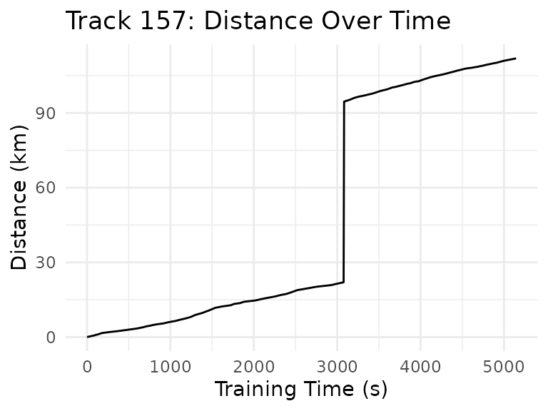

This seems easy enough to fix, though, since it appears that only the
`distance_absolute_m` values for that track seem to have a sudden jump.
Knowing the total length of that track (slightly more than 40 km), and
seeing that there seems to be only one corrupted data point (subsequent
points seem to continue normally), the fix is simply to subtract the
jump from all points with a distance \> 90 km. Assuming the points
between which the jump occurs are $p_{1}$ and $p_{2}$, the height of the
jump is assumed to be
$$\text{jump height} = d\left( p_{2} \right) - d\left( p_{1} \right) - \delta\left( p_{2} \right)$$
(where, for a given point, $d( \cdot )$ means `distance_absolute_m`, and
$\delta( \cdot )$ means `distance_m`). In other words, the true
difference in `distance_absolute_m` between $p_{1}$ and $p_{2}$ is
assumed to be the `distance_m` value of $p_{2}$ (i.e. the distance
travelled during that segment). Any excess difference is assumed to be
erroneous, and is subtracted from $p_{2}$ and all subsequent points.

``` r
corrected_track_details <- track_details |>
  mutate(
    correction = distance_absolute_m - lag(distance_absolute_m, default = 0) - distance_m,
    needs_correction = (distance_absolute_m > 90000) & (date == tracks[157,]$date),
    corrected_distance_absolute_m = ifelse(needs_correction, distance_absolute_m - max(correction), distance_absolute_m))

corrected_tracks <- corrected_track_details |>
  mutate(
    distance_absolute_m = ifelse(needs_correction, corrected_distance_absolute_m, distance_absolute_m)
  ) |>
  summarize_tracks()
```

The resulting distance plot then appears correct:

``` r
corrected_track_details |>
  filter(date == tracks[157,]$date) |>
  ggplot(aes(x = training_time_absolute_s / 100, y = corrected_distance_absolute_m / 1000)) +
  geom_line() +
  labs(x = "Training Time (s)", y = "Distance (km)") +
  ggtitle("Track 157: Corrected Distance Over Time")
```

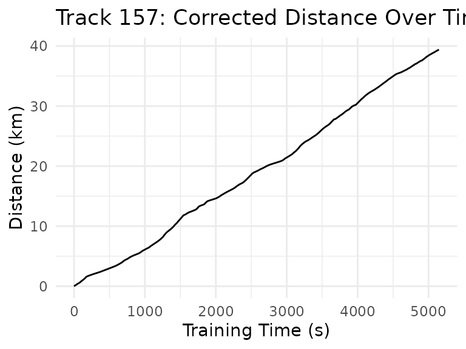

The corrected data is used for all further analyses.

### Linear Models

First, let’s try to fit linear models using different predictors, to get
an idea which predictors might influence the average track speed.

#### Temperature Effects

The first idea is to look for a temperature effect, i.e. does
temperature influence the average speed? Intuitively, there is an
optimum temperature, and lower and higher temperatures should result in
lower performance.

``` r
fit_temperature <- lm(speed_km_h ~ temperature_c, data = corrected_tracks)
summary(fit_temperature)
#> 
#> Call:
#> lm(formula = speed_km_h ~ temperature_c, data = corrected_tracks)
#> 
#> Residuals:
#>     Min      1Q  Median      3Q     Max 
#> -4.1644 -0.8346  0.0939  0.8662  2.8922 
#> 
#> Coefficients:
#>                Estimate Std. Error t value Pr(>|t|)    
#> (Intercept)   28.013494   0.573848  48.817   <2e-16 ***
#> temperature_c -0.006994   0.027551  -0.254      0.8    
#> ---
#> Signif. codes:  0 '***' 0.001 '**' 0.01 '*' 0.05 '.' 0.1 ' ' 1
#> 
#> Residual standard error: 1.296 on 155 degrees of freedom
#> Multiple R-squared:  0.0004156,  Adjusted R-squared:  -0.006033 
#> F-statistic: 0.06444 on 1 and 155 DF,  p-value: 0.7999
```

As can be seen from the model, temperature does not have a statistically
significant influence (the p-Value is 0.8, i.e. nowhere near the 0.05
that would suggest significance). However, the estimated effect is very
small, so there might be some very small effect that would need much
more data to reliably detect.

Another factor might be that a straight line is not well suited to
describe the effect, since the assumed optimum temperature would mean
that e.g. a quadratic function could be a better fit for the data.

``` r
fit_temp_ns <- lm(speed_km_h ~ ns(temperature_c, df = 3), data = corrected_tracks)
fit_temp_bs <- lm(speed_km_h ~ bs(temperature_c, df = 3), data = corrected_tracks)

temp_pred_grid <- seq(from = 10.0, to = 32.5, by = 0.01)
temp_pred_data <- data.frame(temperature_c = temp_pred_grid)
fit_temp_pred <- data.frame(speed_km_h = predict(fit_temperature, temp_pred_data), temperature_c = temp_pred_grid)
fit_temp_ns_pred <- data.frame(speed_km_h = predict(fit_temp_ns, temp_pred_data), temperature_c = temp_pred_grid)
fit_temp_bs_pred <- data.frame(speed_km_h = predict(fit_temp_bs, temp_pred_data), temperature_c = temp_pred_grid)
corrected_tracks |>
  ggplot(aes(x = temperature_c, y = speed_km_h)) +
  geom_point() +
  geom_line(data = fit_temp_pred, color = "red") +
  geom_line(data = fit_temp_ns_pred, color = "green") +
  geom_line(data = fit_temp_bs_pred, color = "blue") +
  labs(x = "Temperature (°C)", y = "Speed (km/h)")
```

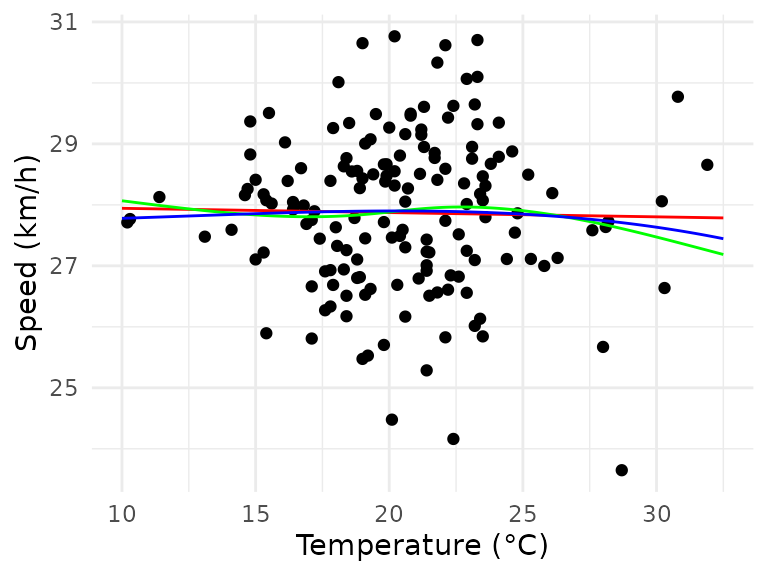

The B-spline (blue) seems to fit slightly better, the natural cubic
spline (green) would not fit well for lower temperatures. However,
neither of the spline models has a significant parameter besides the
intercept, so they are not viable either.

Thus, temperature seems to have either not have any effect, or the
effect is so small that a lot more data would be required to reliably
detect it.

#### Effects of Track Length, Inclination, and Heart Rate

Another model that seems rather intuitive is to use a track’s distance,
average inclination, and average heart rate to model the average speed:

``` r
fit_dihr <- lm(speed_km_h ~ distance_km + avg_inclination + avg_hr_bpm, data = corrected_tracks)
summary(fit_dihr)
#> 
#> Call:
#> lm(formula = speed_km_h ~ distance_km + avg_inclination + avg_hr_bpm, 
#>     data = corrected_tracks)
#> 
#> Residuals:
#>      Min       1Q   Median       3Q      Max 
#> -3.04856 -0.47765  0.08545  0.51618  2.38627 
#> 
#> Coefficients:
#>                   Estimate Std. Error t value Pr(>|t|)    
#> (Intercept)      2.193e+01  1.272e+00  17.243  < 2e-16 ***
#> distance_km     -7.525e-03  3.852e-03  -1.954   0.0526 .  
#> avg_inclination -4.206e+02  3.931e+01 -10.701  < 2e-16 ***
#> avg_hr_bpm       7.484e-02  8.444e-03   8.863 1.87e-15 ***
#> ---
#> Signif. codes:  0 '***' 0.001 '**' 0.01 '*' 0.05 '.' 0.1 ' ' 1
#> 
#> Residual standard error: 0.8418 on 153 degrees of freedom
#> Multiple R-squared:  0.5839, Adjusted R-squared:  0.5757 
#> F-statistic: 71.55 on 3 and 153 DF,  p-value: < 2.2e-16
```

This model shows that inclination and heart rate are highly significant,
whereas the distance is not. The estimated coefficients indicate the
expected relationships:

- steeper tracks (i.e. higher average inclination) have a lower average
  speed
- a higher effort (i.e. a higher average heart rate) leads to a higher
  average speed
- longer distances lead to a lower speed (however, this is relationship
  is not statistically significant)

Furthermore, a model based on these three predictors can account for
almost 60% of the observed variance in the data.

Evaluating the model:

``` r
plot(fit_dihr)
```

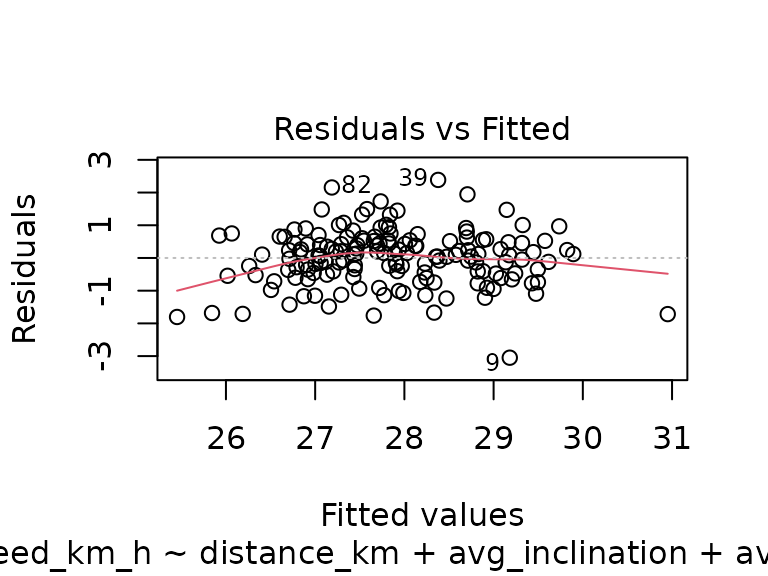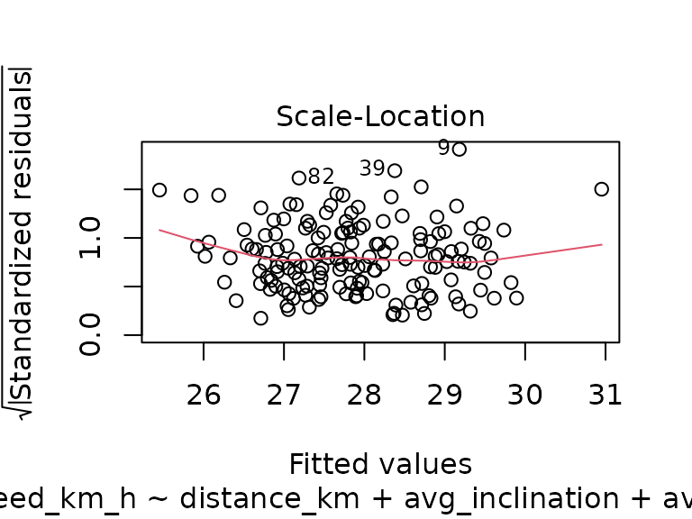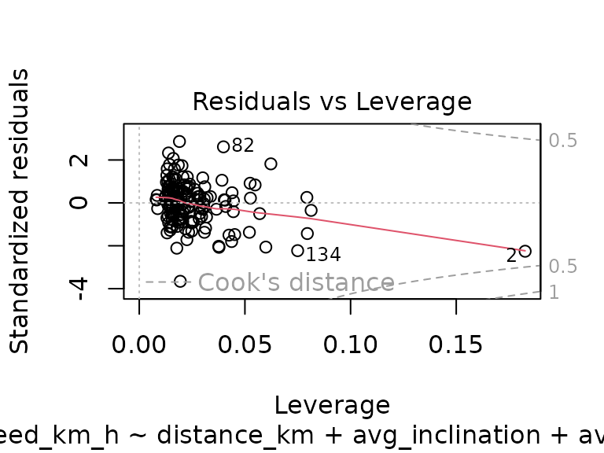

The model has some obvious weaknesses (residuals at the lower and higher
ends of the observed speed spectrum are not as close to zero as they
should be, and one track (number 2) has a relatively large residual
error and leverage), but overall it seems not too bad.

#### Effect of Previous Training Session

Another potential factor to influence average speed is the previous
training: one could reasonably expect that a training session too
shortly after another one would negatively affect speed for the second
training. On the other hand, too long of a break between trainings
should probably also negatively affect average speed (assuming that a
positive effect of a training is slowly lost over time).

To validate this hypothesis, the previous model using distance,
inclination, and heart rate can be extended with the number of days
since the last training, and the previous training’s distance,
inclination and average heart rate:

``` r
corrected_tracks <- corrected_tracks |>
  mutate(
    previous_training_date = lag(date),
    days_since_previous_training = as.numeric(difftime(date, previous_training_date, units = "days"))
  )
augmented_tracks <- corrected_tracks |>
  inner_join(corrected_tracks, join_by(previous_training_date == date), suffix = c("", "_previous_training"))
fit_pt <- lm(speed_km_h ~ distance_km + avg_inclination + avg_hr_bpm + days_since_previous_training + distance_km_previous_training + avg_inclination_previous_training + avg_hr_bpm_previous_training, data = augmented_tracks)
summary(fit_pt)
#> 
#> Call:
#> lm(formula = speed_km_h ~ distance_km + avg_inclination + avg_hr_bpm + 
#>     days_since_previous_training + distance_km_previous_training + 
#>     avg_inclination_previous_training + avg_hr_bpm_previous_training, 
#>     data = augmented_tracks)
#> 
#> Residuals:
#>      Min       1Q   Median       3Q      Max 
#> -2.80543 -0.51481  0.06608  0.49832  2.35074 
#> 
#> Coefficients:
#>                                     Estimate Std. Error t value Pr(>|t|)    
#> (Intercept)                        2.182e+01  1.367e+00  15.967  < 2e-16 ***
#> distance_km                       -1.127e-02  4.125e-03  -2.732  0.00707 ** 
#> avg_inclination                   -4.224e+02  3.935e+01 -10.735  < 2e-16 ***
#> avg_hr_bpm                         7.834e-02  1.219e-02   6.427 1.68e-09 ***
#> days_since_previous_training      -3.606e-03  1.626e-03  -2.218  0.02811 *  
#> distance_km_previous_training      9.850e-03  4.184e-03   2.354  0.01989 *  
#> avg_inclination_previous_training -5.667e+01  3.871e+01  -1.464  0.14534    
#> avg_hr_bpm_previous_training       4.168e-04  1.207e-02   0.035  0.97250    
#> ---
#> Signif. codes:  0 '***' 0.001 '**' 0.01 '*' 0.05 '.' 0.1 ' ' 1
#> 
#> Residual standard error: 0.8206 on 148 degrees of freedom
#> Multiple R-squared:  0.6152, Adjusted R-squared:  0.597 
#> F-statistic:  33.8 on 7 and 148 DF,  p-value: < 2.2e-16
```

In this model, the days since the previous training, and the previous
training’s distance are significant factors, the previous training’s
inclination and average heart rate are not. This seems counterintuitive,
considering in the previous, simpler model (the one without considering
the previous training), the distance was not a significant factor, and
inclination and heart rate were highly significant. In this extended
model, inclination and heart rate are still significant for the current
training, but are not significant for the previous training.
Furthermore, both the current and the previous training’s distance is
now a significant predictor.

While some of the additional predictors are significant, the extended
model only explains about an additional three percentage points of
variance in the data. Additionally, the diagnostic plots look much worse
than for the simpler model:

``` r
plot(fit_pt)
```

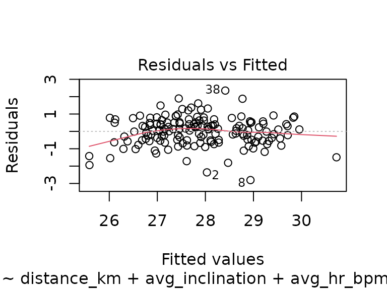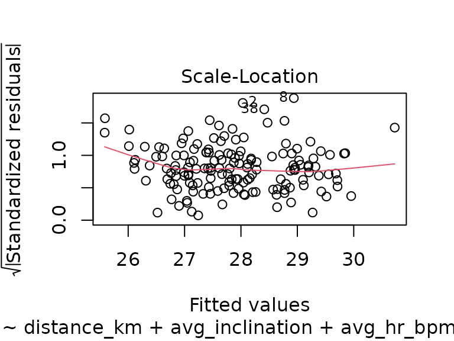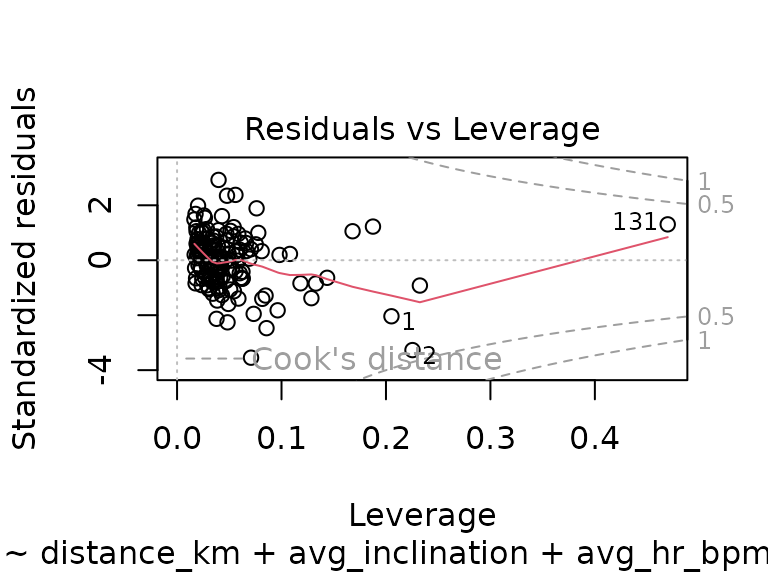

There are now data points with higher leverage than before which also
have larger residuals, the QQ-plot shows a larger deviation from the
diagonal at the low end, and the residuals plot looks worse as well.
Overall, taking the previous training into account seems to not be
worthwile: the model only explains slightly more variance, at the cost
of significantly worse diagnostics.

#### Effects of Training Season

Since the data is actually a time series, it seems likely that there is
a time-based aspect to a potential training effect. In order to take
this into consideration for a linear model, the month and calendar week
were tried as predictors.

``` r
tracks_speed_month <- corrected_tracks |>
  mutate(month = as.factor(month(date))) |>
  select(speed_km_h, month)
  
fit_month <- lm(speed_km_h ~ month, data = tracks_speed_month)
summary(fit_month)
#> 
#> Call:
#> lm(formula = speed_km_h ~ month, data = tracks_speed_month)
#> 
#> Residuals:
#>     Min      1Q  Median      3Q     Max 
#> -3.9110 -0.8636  0.1374  0.7991  3.0588 
#> 
#> Coefficients:
#>             Estimate Std. Error t value Pr(>|t|)    
#> (Intercept)  26.9297     1.2843  20.969   <2e-16 ***
#> month4        1.2657     1.3293   0.952    0.343    
#> month5        1.5226     1.3160   1.157    0.249    
#> month6        0.7667     1.3042   0.588    0.558    
#> month7        0.6297     1.3087   0.481    0.631    
#> month8        0.8073     1.3048   0.619    0.537    
#> month9        1.1544     1.3119   0.880    0.380    
#> month10       0.7003     1.3470   0.520    0.604    
#> ---
#> Signif. codes:  0 '***' 0.001 '**' 0.01 '*' 0.05 '.' 0.1 ' ' 1
#> 
#> Residual standard error: 1.284 on 149 degrees of freedom
#> Multiple R-squared:  0.0568, Adjusted R-squared:  0.01249 
#> F-statistic: 1.282 on 7 and 149 DF,  p-value: 0.263
```

Apparently, later months do not have a significantly different average
speed than the first month in the data (i.e. March). Using Helmert
contrasts instead of the (default) treatment contrasts to compare later
months to preceding months (instead of comparing to the March baseline),
there are again no significant results:

``` r
contrasts(tracks_speed_month$month) <- "contr.helmert"
summary(lm(speed_km_h ~ month, data = tracks_speed_month))
#> 
#> Call:
#> lm(formula = speed_km_h ~ month, data = tracks_speed_month)
#> 
#> Residuals:
#>     Min      1Q  Median      3Q     Max 
#> -3.9110 -0.8636  0.1374  0.7991  3.0588 
#> 
#> Coefficients:
#>             Estimate Std. Error t value Pr(>|t|)    
#> (Intercept) 27.78555    0.18769 148.043   <2e-16 ***
#> month1       0.63286    0.66467   0.952    0.343    
#> month2       0.29659    0.24135   1.229    0.221    
#> month3      -0.04069    0.12675  -0.321    0.749    
#> month4      -0.05181    0.08538  -0.607    0.545    
#> month5      -0.00494    0.06051  -0.082    0.935    
#> month6       0.04605    0.05106   0.902    0.369    
#> month7      -0.02222    0.05695  -0.390    0.697    
#> ---
#> Signif. codes:  0 '***' 0.001 '**' 0.01 '*' 0.05 '.' 0.1 ' ' 1
#> 
#> Residual standard error: 1.284 on 149 degrees of freedom
#> Multiple R-squared:  0.0568, Adjusted R-squared:  0.01249 
#> F-statistic: 1.282 on 7 and 149 DF,  p-value: 0.263
```

Maybe, however, the training effect lies in the fact that later in the
season the average track is longer/steeper/more exhausting in general?

``` r
corrected_tracks |>
  ggplot(aes(x = as.factor(month(date)), y = distance_km)) +
  geom_boxplot() +
  geom_jitter(width = 0.25, color = "#0000f0", alpha = 0.5) +
  labs(x = "Month", y = "Distance (km)") +
  ggtitle("Track Length by Month")
```

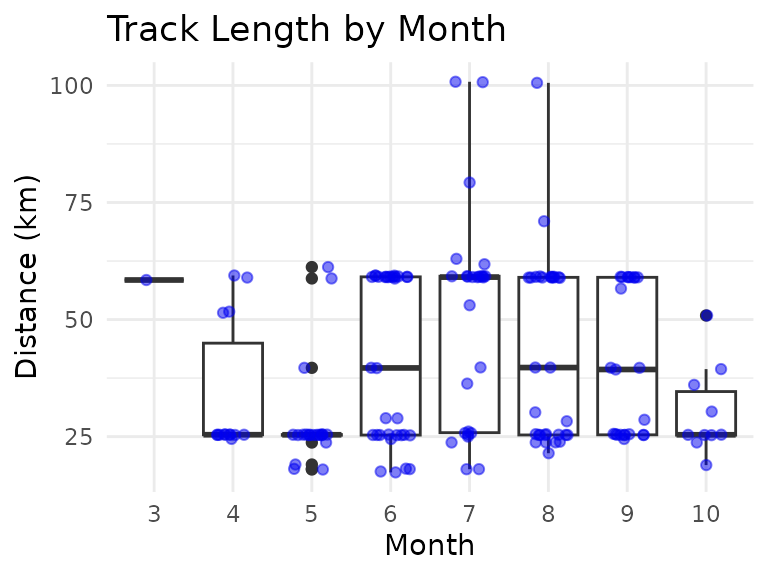

Overall, and with the exception of March (for which there is only one
data point), at least the median length of the tracks seems to follow a
pattern of longer tracks during the summer, and shorter tracks at the
beginning and end of the season. This might be related to fitness level,
and/or to the weather (temperature, precipitation) and available
daylight (longer days in the summer months, shorter days in spring and
fall).

Thus, let’s try a model taking into account the month, as well as the
distance, inclination, and heart rate, and their interaction with the
month:

``` r
fit_month_and_more <- lm(speed_km_h ~ as.factor(month(date)) * (distance_km + avg_hr_bpm + avg_inclination), data = corrected_tracks)
summary(fit_month_and_more)
#> 
#> Call:
#> lm(formula = speed_km_h ~ as.factor(month(date)) * (distance_km + 
#>     avg_hr_bpm + avg_inclination), data = corrected_tracks)
#> 
#> Residuals:
#>      Min       1Q   Median       3Q      Max 
#> -2.18792 -0.40704  0.06077  0.41516  1.79607 
#> 
#> Coefficients: (3 not defined because of singularities)
#>                                            Estimate Std. Error t value Pr(>|t|)
#> (Intercept)                               2.422e+01  4.299e+00   5.634 1.07e-07
#> as.factor(month(date))4                   1.401e+01  7.179e+00   1.951  0.05321
#> as.factor(month(date))5                   5.452e+00  6.390e+00   0.853  0.39518
#> as.factor(month(date))6                  -8.583e+00  4.885e+00  -1.757  0.08127
#> as.factor(month(date))7                  -8.261e+00  5.284e+00  -1.564  0.12040
#> as.factor(month(date))8                  -3.090e+00  5.144e+00  -0.601  0.54910
#> as.factor(month(date))9                  -3.777e+00  5.314e+00  -0.711  0.47846
#> as.factor(month(date))10                  9.444e-01  1.118e+00   0.845  0.39987
#> distance_km                               9.491e-03  3.007e-02   0.316  0.75282
#> avg_hr_bpm                                3.443e-02  3.118e-02   1.104  0.27154
#> avg_inclination                          -2.591e+02  1.093e+02  -2.371  0.01921
#> as.factor(month(date))4:distance_km      -5.165e-02  3.450e-02  -1.497  0.13681
#> as.factor(month(date))5:distance_km      -2.113e-02  3.532e-02  -0.598  0.55074
#> as.factor(month(date))6:distance_km      -4.167e-03  3.127e-02  -0.133  0.89417
#> as.factor(month(date))7:distance_km      -2.269e-02  3.081e-02  -0.737  0.46274
#> as.factor(month(date))8:distance_km      -1.204e-02  3.098e-02  -0.389  0.69826
#> as.factor(month(date))9:distance_km      -3.563e-02  3.284e-02  -1.085  0.27999
#> as.factor(month(date))10:distance_km             NA         NA      NA       NA
#> as.factor(month(date))4:avg_hr_bpm       -6.154e-02  5.019e-02  -1.226  0.22238
#> as.factor(month(date))5:avg_hr_bpm       -7.934e-03  4.438e-02  -0.179  0.85839
#> as.factor(month(date))6:avg_hr_bpm        1.045e-01  3.699e-02   2.824  0.00550
#> as.factor(month(date))7:avg_hr_bpm        7.897e-02  3.694e-02   2.138  0.03443
#> as.factor(month(date))8:avg_hr_bpm        5.322e-02  3.585e-02   1.484  0.14020
#> as.factor(month(date))9:avg_hr_bpm        3.792e-02  3.807e-02   0.996  0.32108
#> as.factor(month(date))10:avg_hr_bpm              NA         NA      NA       NA
#> as.factor(month(date))4:avg_inclination  -1.792e+02  1.718e+02  -1.043  0.29875
#> as.factor(month(date))5:avg_inclination  -2.062e+02  1.590e+02  -1.297  0.19707
#> as.factor(month(date))6:avg_inclination  -4.468e+02  1.669e+02  -2.677  0.00841
#> as.factor(month(date))7:avg_inclination  -1.110e+02  1.336e+02  -0.831  0.40770
#> as.factor(month(date))8:avg_inclination  -2.608e+02  1.321e+02  -1.974  0.05057
#> as.factor(month(date))9:avg_inclination   9.679e+01  1.685e+02   0.575  0.56663
#> as.factor(month(date))10:avg_inclination         NA         NA      NA       NA
#>                                             
#> (Intercept)                              ***
#> as.factor(month(date))4                  .  
#> as.factor(month(date))5                     
#> as.factor(month(date))6                  .  
#> as.factor(month(date))7                     
#> as.factor(month(date))8                     
#> as.factor(month(date))9                     
#> as.factor(month(date))10                    
#> distance_km                                 
#> avg_hr_bpm                                  
#> avg_inclination                          *  
#> as.factor(month(date))4:distance_km         
#> as.factor(month(date))5:distance_km         
#> as.factor(month(date))6:distance_km         
#> as.factor(month(date))7:distance_km         
#> as.factor(month(date))8:distance_km         
#> as.factor(month(date))9:distance_km         
#> as.factor(month(date))10:distance_km        
#> as.factor(month(date))4:avg_hr_bpm          
#> as.factor(month(date))5:avg_hr_bpm          
#> as.factor(month(date))6:avg_hr_bpm       ** 
#> as.factor(month(date))7:avg_hr_bpm       *  
#> as.factor(month(date))8:avg_hr_bpm          
#> as.factor(month(date))9:avg_hr_bpm          
#> as.factor(month(date))10:avg_hr_bpm         
#> as.factor(month(date))4:avg_inclination     
#> as.factor(month(date))5:avg_inclination     
#> as.factor(month(date))6:avg_inclination  ** 
#> as.factor(month(date))7:avg_inclination     
#> as.factor(month(date))8:avg_inclination  .  
#> as.factor(month(date))9:avg_inclination     
#> as.factor(month(date))10:avg_inclination    
#> ---
#> Signif. codes:  0 '***' 0.001 '**' 0.01 '*' 0.05 '.' 0.1 ' ' 1
#> 
#> Residual standard error: 0.7615 on 128 degrees of freedom
#> Multiple R-squared:  0.7151, Adjusted R-squared:  0.6528 
#> F-statistic: 11.48 on 28 and 128 DF,  p-value: < 2.2e-16
```

Due to the dummy-coded month variable and the interactions, there are
now a lot more parameters, only few of which are significant.
Furthermore, the interactions with the October-level of the month
variable produce `NA`s, suggesting multicollinearity or some other
problem.

The model now explains about 71% of the variance in the data, however,
due to the model complexity, and the large number of non-significant
parameters, it appears dubious whether the model is appropriate.

The diagnostic plots, on the other hand, don’t look too bad (though
worse than those of the simpler model using just distance, inclination,
and heart rate):

``` r
plot(fit_month_and_more)
```

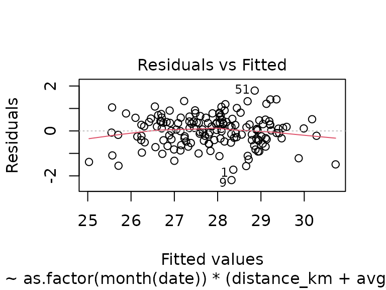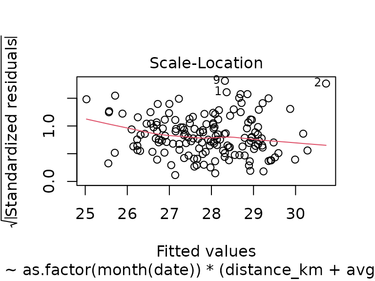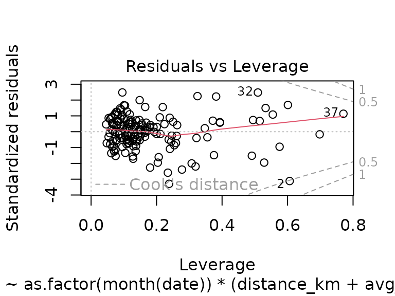

Trying the same thing with higher temporal resolution (using calendar
week instead of month) is pointless, though:

``` r
corrected_tracks |>
  ggplot(aes(x = as.factor(isoweek(date)), y = distance_km)) +
  geom_boxplot() +
  geom_jitter(width = 0.25, color = "#0000f0", alpha = 0.5) +
  labs(x = "Calendar Week", y = "Distance (km)") +
  ggtitle("Track Length by Calendar Week")
```

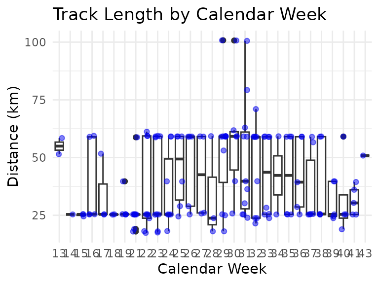

There are now a lot more factor levels, and correspondingly fewer data
points per level, so fitting a model in the same way as for month just
results in a model with lots of non-significant parameters:

    #> 
    #> Call:
    #> lm(formula = speed_km_h ~ as.factor(isoweek(date)) * (distance_km + 
    #>     avg_hr_bpm + avg_inclination), data = corrected_tracks)
    #> 
    #> Residuals:
    #>     Min      1Q  Median      3Q     Max 
    #> -1.9400 -0.2377  0.0000  0.1475  2.1459 
    #> 
    #> Coefficients: (15 not defined because of singularities)
    #>                                              Estimate Std. Error t value
    #> (Intercept)                                 1.783e+01  9.223e+00   1.933
    #> as.factor(isoweek(date))14                  5.127e-01  5.991e+00   0.086
    #> as.factor(isoweek(date))15                  4.730e+01  2.201e+02   0.215
    #> as.factor(isoweek(date))16                  6.872e+01  2.573e+01   2.671
    #> as.factor(isoweek(date))17                  8.307e+00  3.011e+01   0.276
    #> as.factor(isoweek(date))18                 -1.559e+02  2.703e+02  -0.577
    #> as.factor(isoweek(date))19                  3.307e+01  5.343e+01   0.619
    #> as.factor(isoweek(date))21                  8.707e+00  1.115e+01   0.781
    #> as.factor(isoweek(date))22                  1.745e+00  1.091e+01   0.160
    #> as.factor(isoweek(date))23                 -8.769e-01  1.183e+01  -0.074
    #> as.factor(isoweek(date))24                  9.441e-01  1.003e+01   0.094
    #> as.factor(isoweek(date))25                 -2.428e+00  1.210e+01  -0.201
    #> as.factor(isoweek(date))26                 -1.566e+01  1.218e+01  -1.286
    #> as.factor(isoweek(date))27                  3.127e+01  1.841e+02   0.170
    #> as.factor(isoweek(date))28                 -4.288e+00  1.119e+01  -0.383
    #> as.factor(isoweek(date))29                 -8.458e+00  1.112e+01  -0.760
    #> as.factor(isoweek(date))30                 -1.976e+00  1.248e+01  -0.158
    #> as.factor(isoweek(date))31                  8.720e+00  1.027e+01   0.849
    #> as.factor(isoweek(date))32                  3.753e+00  1.064e+01   0.353
    #> as.factor(isoweek(date))33                 -4.268e+00  1.301e+01  -0.328
    #> as.factor(isoweek(date))34                  9.199e-01  1.048e+01   0.088
    #> as.factor(isoweek(date))35                  3.831e+00  4.188e+01   0.091
    #> as.factor(isoweek(date))36                  4.993e+00  2.165e+01   0.231
    #> as.factor(isoweek(date))37                  1.808e+01  2.441e+01   0.741
    #> as.factor(isoweek(date))38                 -6.360e+00  6.210e+01  -0.102
    #> as.factor(isoweek(date))39                 -1.552e+01  1.619e+01  -0.959
    #> as.factor(isoweek(date))40                  1.379e+01  1.898e+01   0.727
    #> as.factor(isoweek(date))41                 -1.676e+00  1.078e+01  -0.155
    #> as.factor(isoweek(date))43                  7.124e-01  1.497e+00   0.476
    #> distance_km                                 1.894e-03  1.898e-01   0.010
    #> avg_hr_bpm                                  8.325e-02  5.184e-02   1.606
    #> avg_inclination                            -3.201e+02  1.609e+02  -1.990
    #> as.factor(isoweek(date))14:distance_km             NA         NA      NA
    #> as.factor(isoweek(date))15:distance_km     -1.519e-01  1.404e+00  -0.108
    #> as.factor(isoweek(date))16:distance_km      7.010e-01  4.406e-01   1.591
    #> as.factor(isoweek(date))17:distance_km     -2.736e-02  1.931e-01  -0.142
    #> as.factor(isoweek(date))18:distance_km      6.243e+00  1.063e+01   0.587
    #> as.factor(isoweek(date))19:distance_km      6.980e-01  7.662e-01   0.911
    #> as.factor(isoweek(date))21:distance_km     -5.726e-03  1.916e-01  -0.030
    #> as.factor(isoweek(date))22:distance_km     -2.839e-03  1.907e-01  -0.015
    #> as.factor(isoweek(date))23:distance_km      2.902e-03  1.909e-01   0.015
    #> as.factor(isoweek(date))24:distance_km     -7.468e-03  1.918e-01  -0.039
    #> as.factor(isoweek(date))25:distance_km     -2.234e-02  1.949e-01  -0.115
    #> as.factor(isoweek(date))26:distance_km     -8.857e-04  1.912e-01  -0.005
    #> as.factor(isoweek(date))27:distance_km      4.921e-01  2.727e+00   0.180
    #> as.factor(isoweek(date))28:distance_km     -1.889e-03  1.915e-01  -0.010
    #> as.factor(isoweek(date))29:distance_km     -2.818e-02  1.902e-01  -0.148
    #> as.factor(isoweek(date))30:distance_km     -2.480e-02  1.905e-01  -0.130
    #> as.factor(isoweek(date))31:distance_km     -3.739e-03  1.900e-01  -0.020
    #> as.factor(isoweek(date))32:distance_km     -8.034e-03  1.904e-01  -0.042
    #> as.factor(isoweek(date))33:distance_km     -1.355e-02  1.906e-01  -0.071
    #> as.factor(isoweek(date))34:distance_km      1.575e-02  1.901e-01   0.083
    #> as.factor(isoweek(date))35:distance_km      3.925e-02  4.197e-01   0.094
    #> as.factor(isoweek(date))36:distance_km     -1.310e-02  1.916e-01  -0.068
    #> as.factor(isoweek(date))37:distance_km      1.773e-01  3.463e-01   0.512
    #> as.factor(isoweek(date))38:distance_km     -1.810e-01  6.844e-01  -0.264
    #> as.factor(isoweek(date))39:distance_km     -1.334e-02  1.978e-01  -0.067
    #> as.factor(isoweek(date))40:distance_km      5.990e-03  1.919e-01   0.031
    #> as.factor(isoweek(date))41:distance_km      7.456e-02  2.017e-01   0.370
    #> as.factor(isoweek(date))43:distance_km             NA         NA      NA
    #> as.factor(isoweek(date))14:avg_hr_bpm              NA         NA      NA
    #> as.factor(isoweek(date))15:avg_hr_bpm      -2.782e-01  1.389e+00  -0.200
    #> as.factor(isoweek(date))16:avg_hr_bpm      -4.800e-02  1.188e-01  -0.404
    #> as.factor(isoweek(date))17:avg_hr_bpm      -4.019e-02  2.009e-01  -0.200
    #> as.factor(isoweek(date))18:avg_hr_bpm              NA         NA      NA
    #> as.factor(isoweek(date))19:avg_hr_bpm      -3.379e-02  1.875e-01  -0.180
    #> as.factor(isoweek(date))21:avg_hr_bpm      -2.646e-02  7.117e-02  -0.372
    #> as.factor(isoweek(date))22:avg_hr_bpm       7.164e-03  6.783e-02   0.106
    #> as.factor(isoweek(date))23:avg_hr_bpm       4.386e-02  8.661e-02   0.506
    #> as.factor(isoweek(date))24:avg_hr_bpm       3.671e-02  7.105e-02   0.517
    #> as.factor(isoweek(date))25:avg_hr_bpm       1.050e-01  9.454e-02   1.110
    #> as.factor(isoweek(date))26:avg_hr_bpm       1.392e-01  7.541e-02   1.847
    #> as.factor(isoweek(date))27:avg_hr_bpm       4.189e-02  1.972e-01   0.212
    #> as.factor(isoweek(date))28:avg_hr_bpm       3.029e-02  7.143e-02   0.424
    #> as.factor(isoweek(date))29:avg_hr_bpm       7.027e-02  6.379e-02   1.101
    #> as.factor(isoweek(date))30:avg_hr_bpm       4.646e-02  7.709e-02   0.603
    #> as.factor(isoweek(date))31:avg_hr_bpm      -4.919e-02  5.967e-02  -0.824
    #> as.factor(isoweek(date))32:avg_hr_bpm       1.709e-02  6.734e-02   0.254
    #> as.factor(isoweek(date))33:avg_hr_bpm       4.439e-02  7.239e-02   0.613
    #> as.factor(isoweek(date))34:avg_hr_bpm              NA         NA      NA
    #> as.factor(isoweek(date))35:avg_hr_bpm       2.786e-02  9.976e-02   0.279
    #> as.factor(isoweek(date))36:avg_hr_bpm      -1.468e-02  1.264e-01  -0.116
    #> as.factor(isoweek(date))37:avg_hr_bpm      -3.462e-02  7.016e-02  -0.493
    #> as.factor(isoweek(date))38:avg_hr_bpm      -4.966e-02  7.755e-02  -0.640
    #> as.factor(isoweek(date))39:avg_hr_bpm       1.084e-01  9.900e-02   1.095
    #> as.factor(isoweek(date))40:avg_hr_bpm      -1.295e-01  1.858e-01  -0.697
    #> as.factor(isoweek(date))41:avg_hr_bpm              NA         NA      NA
    #> as.factor(isoweek(date))43:avg_hr_bpm              NA         NA      NA
    #> as.factor(isoweek(date))14:avg_inclination         NA         NA      NA
    #> as.factor(isoweek(date))15:avg_inclination         NA         NA      NA
    #> as.factor(isoweek(date))16:avg_inclination -8.300e+03  4.507e+03  -1.841
    #> as.factor(isoweek(date))17:avg_inclination         NA         NA      NA
    #> as.factor(isoweek(date))18:avg_inclination         NA         NA      NA
    #> as.factor(isoweek(date))19:avg_inclination -4.700e+03  5.102e+03  -0.921
    #> as.factor(isoweek(date))21:avg_inclination -3.398e+02  3.040e+02  -1.118
    #> as.factor(isoweek(date))22:avg_inclination -1.167e+02  2.458e+02  -0.475
    #> as.factor(isoweek(date))23:avg_inclination -3.543e+02  4.112e+02  -0.862
    #> as.factor(isoweek(date))24:avg_inclination -3.861e+02  5.216e+02  -0.740
    #> as.factor(isoweek(date))25:avg_inclination -8.385e+02  7.079e+02  -1.184
    #> as.factor(isoweek(date))26:avg_inclination -2.399e+02  2.880e+02  -0.833
    #> as.factor(isoweek(date))27:avg_inclination -5.289e+03  3.030e+04  -0.175
    #> as.factor(isoweek(date))28:avg_inclination         NA         NA      NA
    #> as.factor(isoweek(date))29:avg_inclination  8.114e+01  2.879e+02   0.282
    #> as.factor(isoweek(date))30:avg_inclination -1.315e+02  3.317e+02  -0.397
    #> as.factor(isoweek(date))31:avg_inclination -2.751e+01  1.835e+02  -0.150
    #> as.factor(isoweek(date))32:avg_inclination -3.697e+02  2.639e+02  -1.401
    #> as.factor(isoweek(date))33:avg_inclination  1.019e+01  2.583e+02   0.039
    #> as.factor(isoweek(date))34:avg_inclination         NA         NA      NA
    #> as.factor(isoweek(date))35:avg_inclination -7.534e+02  4.309e+03  -0.175
    #> as.factor(isoweek(date))36:avg_inclination -7.249e+01  3.743e+02  -0.194
    #> as.factor(isoweek(date))37:avg_inclination -1.766e+03  3.178e+03  -0.556
    #> as.factor(isoweek(date))38:avg_inclination  2.181e+03  7.739e+03   0.282
    #> as.factor(isoweek(date))39:avg_inclination  1.863e+02  2.521e+02   0.739
    #> as.factor(isoweek(date))40:avg_inclination  5.615e+02  9.226e+02   0.609
    #> as.factor(isoweek(date))41:avg_inclination         NA         NA      NA
    #> as.factor(isoweek(date))43:avg_inclination         NA         NA      NA
    #>                                            Pr(>|t|)   
    #> (Intercept)                                 0.05831 . 
    #> as.factor(isoweek(date))14                  0.93210   
    #> as.factor(isoweek(date))15                  0.83061   
    #> as.factor(isoweek(date))16                  0.00989 **
    #> as.factor(isoweek(date))17                  0.78365   
    #> as.factor(isoweek(date))18                  0.56627   
    #> as.factor(isoweek(date))19                  0.53855   
    #> as.factor(isoweek(date))21                  0.43819   
    #> as.factor(isoweek(date))22                  0.87352   
    #> as.factor(isoweek(date))23                  0.94118   
    #> as.factor(isoweek(date))24                  0.92535   
    #> as.factor(isoweek(date))25                  0.84163   
    #> as.factor(isoweek(date))26                  0.20374   
    #> as.factor(isoweek(date))27                  0.86573   
    #> as.factor(isoweek(date))28                  0.70295   
    #> as.factor(isoweek(date))29                  0.45025   
    #> as.factor(isoweek(date))30                  0.87473   
    #> as.factor(isoweek(date))31                  0.39935   
    #> as.factor(isoweek(date))32                  0.72566   
    #> as.factor(isoweek(date))33                  0.74411   
    #> as.factor(isoweek(date))34                  0.93039   
    #> as.factor(isoweek(date))35                  0.92744   
    #> as.factor(isoweek(date))36                  0.81840   
    #> as.factor(isoweek(date))37                  0.46202   
    #> as.factor(isoweek(date))38                  0.91878   
    #> as.factor(isoweek(date))39                  0.34181   
    #> as.factor(isoweek(date))40                  0.47051   
    #> as.factor(isoweek(date))41                  0.87701   
    #> as.factor(isoweek(date))43                  0.63598   
    #> distance_km                                 0.99207   
    #> avg_hr_bpm                                  0.11391   
    #> avg_inclination                             0.05153 . 
    #> as.factor(isoweek(date))14:distance_km           NA   
    #> as.factor(isoweek(date))15:distance_km      0.91422   
    #> as.factor(isoweek(date))16:distance_km      0.11719   
    #> as.factor(isoweek(date))17:distance_km      0.88786   
    #> as.factor(isoweek(date))18:distance_km      0.55945   
    #> as.factor(isoweek(date))19:distance_km      0.36623   
    #> as.factor(isoweek(date))21:distance_km      0.97626   
    #> as.factor(isoweek(date))22:distance_km      0.98818   
    #> as.factor(isoweek(date))23:distance_km      0.98793   
    #> as.factor(isoweek(date))24:distance_km      0.96909   
    #> as.factor(isoweek(date))25:distance_km      0.90915   
    #> as.factor(isoweek(date))26:distance_km      0.99632   
    #> as.factor(isoweek(date))27:distance_km      0.85742   
    #> as.factor(isoweek(date))28:distance_km      0.99216   
    #> as.factor(isoweek(date))29:distance_km      0.88273   
    #> as.factor(isoweek(date))30:distance_km      0.89688   
    #> as.factor(isoweek(date))31:distance_km      0.98437   
    #> as.factor(isoweek(date))32:distance_km      0.96649   
    #> as.factor(isoweek(date))33:distance_km      0.94360   
    #> as.factor(isoweek(date))34:distance_km      0.93427   
    #> as.factor(isoweek(date))35:distance_km      0.92583   
    #> as.factor(isoweek(date))36:distance_km      0.94572   
    #> as.factor(isoweek(date))37:distance_km      0.61058   
    #> as.factor(isoweek(date))38:distance_km      0.79237   
    #> as.factor(isoweek(date))39:distance_km      0.94648   
    #> as.factor(isoweek(date))40:distance_km      0.97521   
    #> as.factor(isoweek(date))41:distance_km      0.71303   
    #> as.factor(isoweek(date))43:distance_km           NA   
    #> as.factor(isoweek(date))14:avg_hr_bpm            NA   
    #> as.factor(isoweek(date))15:avg_hr_bpm       0.84191   
    #> as.factor(isoweek(date))16:avg_hr_bpm       0.68769   
    #> as.factor(isoweek(date))17:avg_hr_bpm       0.84212   
    #> as.factor(isoweek(date))18:avg_hr_bpm            NA   
    #> as.factor(isoweek(date))19:avg_hr_bpm       0.85764   
    #> as.factor(isoweek(date))21:avg_hr_bpm       0.71145   
    #> as.factor(isoweek(date))22:avg_hr_bpm       0.91626   
    #> as.factor(isoweek(date))23:avg_hr_bpm       0.61458   
    #> as.factor(isoweek(date))24:avg_hr_bpm       0.60744   
    #> as.factor(isoweek(date))25:avg_hr_bpm       0.27163   
    #> as.factor(isoweek(date))26:avg_hr_bpm       0.07009 . 
    #> as.factor(isoweek(date))27:avg_hr_bpm       0.83252   
    #> as.factor(isoweek(date))28:avg_hr_bpm       0.67312   
    #> as.factor(isoweek(date))29:avg_hr_bpm       0.27541   
    #> as.factor(isoweek(date))30:avg_hr_bpm       0.54916   
    #> as.factor(isoweek(date))31:avg_hr_bpm       0.41327   
    #> as.factor(isoweek(date))32:avg_hr_bpm       0.80053   
    #> as.factor(isoweek(date))33:avg_hr_bpm       0.54226   
    #> as.factor(isoweek(date))34:avg_hr_bpm            NA   
    #> as.factor(isoweek(date))35:avg_hr_bpm       0.78109   
    #> as.factor(isoweek(date))36:avg_hr_bpm       0.90797   
    #> as.factor(isoweek(date))37:avg_hr_bpm       0.62365   
    #> as.factor(isoweek(date))38:avg_hr_bpm       0.52450   
    #> as.factor(isoweek(date))39:avg_hr_bpm       0.27830   
    #> as.factor(isoweek(date))40:avg_hr_bpm       0.48882   
    #> as.factor(isoweek(date))41:avg_hr_bpm            NA   
    #> as.factor(isoweek(date))43:avg_hr_bpm            NA   
    #> as.factor(isoweek(date))14:avg_inclination       NA   
    #> as.factor(isoweek(date))15:avg_inclination       NA   
    #> as.factor(isoweek(date))16:avg_inclination  0.07087 . 
    #> as.factor(isoweek(date))17:avg_inclination       NA   
    #> as.factor(isoweek(date))18:avg_inclination       NA   
    #> as.factor(isoweek(date))19:avg_inclination  0.36091   
    #> as.factor(isoweek(date))21:avg_inclination  0.26845   
    #> as.factor(isoweek(date))22:avg_inclination  0.63664   
    #> as.factor(isoweek(date))23:avg_inclination  0.39263   
    #> as.factor(isoweek(date))24:avg_inclination  0.46222   
    #> as.factor(isoweek(date))25:avg_inclination  0.24124   
    #> as.factor(isoweek(date))26:avg_inclination  0.40844   
    #> as.factor(isoweek(date))27:avg_inclination  0.86206   
    #> as.factor(isoweek(date))28:avg_inclination       NA   
    #> as.factor(isoweek(date))29:avg_inclination  0.77908   
    #> as.factor(isoweek(date))30:avg_inclination  0.69319   
    #> as.factor(isoweek(date))31:avg_inclination  0.88137   
    #> as.factor(isoweek(date))32:avg_inclination  0.16673   
    #> as.factor(isoweek(date))33:avg_inclination  0.96866   
    #> as.factor(isoweek(date))34:avg_inclination       NA   
    #> as.factor(isoweek(date))35:avg_inclination  0.86181   
    #> as.factor(isoweek(date))36:avg_inclination  0.84713   
    #> as.factor(isoweek(date))37:avg_inclination  0.58066   
    #> as.factor(isoweek(date))38:avg_inclination  0.77913   
    #> as.factor(isoweek(date))39:avg_inclination  0.46301   
    #> as.factor(isoweek(date))40:avg_inclination  0.54523   
    #> as.factor(isoweek(date))41:avg_inclination       NA   
    #> as.factor(isoweek(date))43:avg_inclination       NA   
    #> ---
    #> Signif. codes:  0 '***' 0.001 '**' 0.01 '*' 0.05 '.' 0.1 ' ' 1
    #> 
    #> Residual standard error: 0.7884 on 56 degrees of freedom
    #> Multiple R-squared:  0.8664, Adjusted R-squared:  0.6279 
    #> F-statistic: 3.632 on 100 and 56 DF,  p-value: 3.102e-07

While the R-squared has again improved (now explaining 86% of the
variance), the diagnostics plots look terrible (see QQ-plot, and
residuals vs. leverage plot), suggesting the same thing mentioned
before: realistically, the model is useless.

``` r
plot(fit_calendar_week_and_more)
```

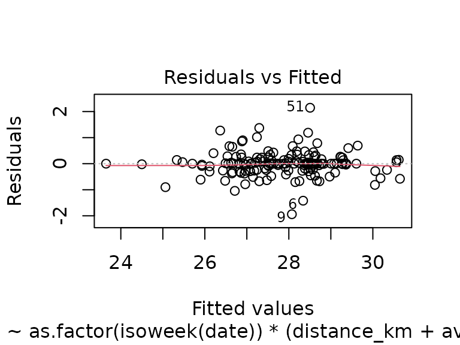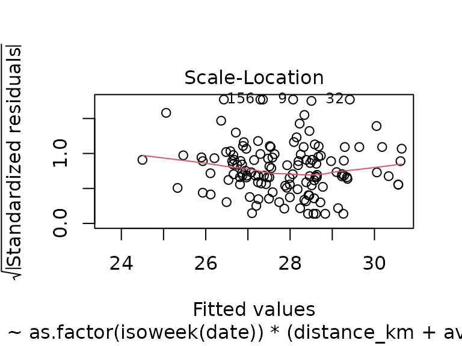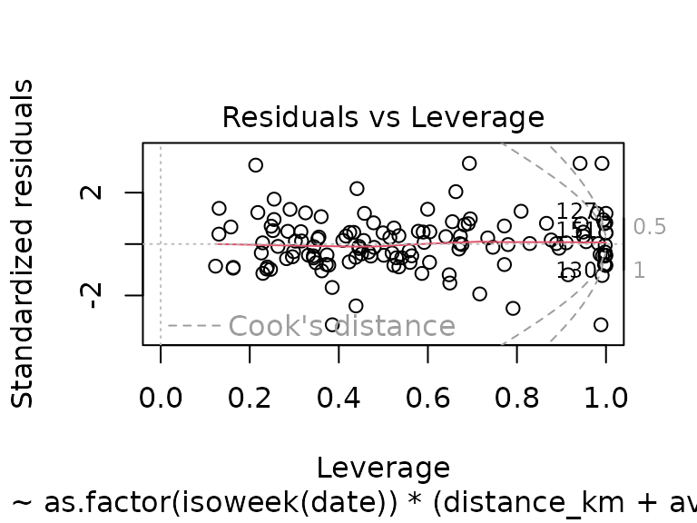

#### ElasticNet

In order to identify which predictors are important, an ElasticNet fit
can be tried. The point to keep in mind here is that the average
inclination is a very important predictor, but the values are very
small, which will result in a rather large model coefficient. Therefore,
to make the other coefficients visible in the trace plot, the
`avg_inclination` value was scaled by a factor of 100 (i.e. an average
inclination of 1 now corresponds to 1% of inclination).

``` r
numerical_track_components <- corrected_tracks |>
  select(!date & !previous_training_date & !weekday & !samples & !altitude_gain_m) |>
  mutate(avg_inclination = avg_inclination * 100) # scale avg. inclination to %

training_set_ratio <- 0.7
training_set_indices <- 
  sample(1:nrow(numerical_track_components),
         nrow(numerical_track_components) * training_set_ratio) |>
  sort()
training_set <- numerical_track_components[training_set_indices,]
test_set <- numerical_track_components[setdiff(1:nrow(numerical_track_components), training_set_indices),]

# glmnet mixing param (hyperparameter; should be tuned instead of hard-coded)
# for now: alpha = 1, i.e. Lasso regression (0 = Ridge; 0 < alpha < 1 = mixed)
alpha <- 1

fit_glm <- glmnet(
  x = training_set |> na.omit() |> select(!speed_km_h),
  y = training_set |> na.omit() |> select(speed_km_h) |> as.matrix(),
  alpha = alpha)
cv_glm <- cv.glmnet(
  x = training_set |> na.omit() |> select(!speed_km_h) |> as.matrix(),
  y = training_set |> na.omit() |> select(speed_km_h) |> as.matrix(),
  alpha = alpha)
plot(fit_glm, xvar = "lambda")
```

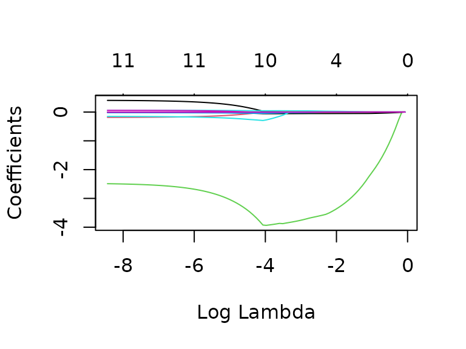

``` r
plot(cv_glm)
```

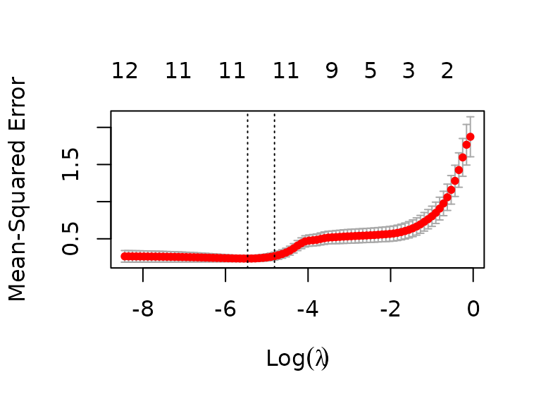

As can be seen, with a Lasso regression, the algorithm will create a
model using 11 predictors (and an intercept) for both the 1 SE
$\lambda$, and for the minimum MSE $\lambda$:

``` r
coef(fit_glm, cv_glm$lambda.1se)
#> 13 x 1 sparse Matrix of class "dgCMatrix"
#>                              s=0.008125304
#> (Intercept)                   24.544688191
#> distance_km                    0.222572784
#> time_min                      -0.096183174
#> avg_inclination               -3.157811718
#> temperature_c                 -0.010519095
#> avg_hr_bpm                     0.051116808
#> below_zones_min                0.017428942
#> zone1_min                     -0.028204552
#> zone2_min                     -0.010900509
#> zone3_min                      .          
#> zone4_min                     -0.035141159
#> above_zones_min               -0.226121274
#> days_since_previous_training  -0.001913364
```

``` r
coef(fit_glm, cv_glm$lambda.min)
#> 13 x 1 sparse Matrix of class "dgCMatrix"
#>                              s=0.00423654
#> (Intercept)                  23.174671976
#> distance_km                   0.312168642
#> time_min                     -0.140060373
#> avg_inclination              -2.829044363
#> temperature_c                -0.007161805
#> avg_hr_bpm                    0.056357324
#> below_zones_min               0.037595273
#> zone1_min                    -0.016642557
#> zone2_min                    -0.006091218
#> zone3_min                     .          
#> zone4_min                    -0.028929052
#> above_zones_min              -0.190123416
#> days_since_previous_training -0.001988406
```

However, in both models there are a lot of variables that are probably
relatively strongly correlated (e.g. all the heart rate variables, or
the time and distance variables):

``` r
cor(numerical_track_components)
#>                              distance_km    time_min avg_inclination
#> distance_km                   1.00000000  0.99474215      0.33422876
#> time_min                      0.99474215  1.00000000      0.37183666
#> avg_inclination               0.33422876  0.37183666      1.00000000
#> temperature_c                -0.19636208 -0.18316844     -0.07903338
#> speed_km_h                   -0.32500914 -0.40933582     -0.59341356
#> avg_hr_bpm                   -0.03815031 -0.08038793      0.08161380
#> below_zones_min               0.40972476  0.45401028      0.23265284
#> zone1_min                     0.54084746  0.59348768      0.20371427
#> zone2_min                     0.86476066  0.88317090      0.23984065
#> zone3_min                     0.84223292  0.81063842      0.30831494
#> zone4_min                     0.22653389  0.21070544      0.28612873
#> above_zones_min              -0.04612616 -0.04857525     -0.03472193
#> days_since_previous_training          NA          NA              NA
#>                              temperature_c  speed_km_h  avg_hr_bpm
#> distance_km                    -0.19636208 -0.32500914 -0.03815031
#> time_min                       -0.18316844 -0.40933582 -0.08038793
#> avg_inclination                -0.07903338 -0.59341356  0.08161380
#> temperature_c                   1.00000000 -0.02038533  0.01996374
#> speed_km_h                     -0.02038533  1.00000000  0.42046295
#> avg_hr_bpm                      0.01996374  0.42046295  1.00000000
#> below_zones_min                -0.04451513 -0.50554421 -0.64326362
#> zone1_min                      -0.06514123 -0.64175561 -0.69347190
#> zone2_min                      -0.11765521 -0.45588197 -0.36525954
#> zone3_min                      -0.19647189 -0.04905263  0.38113546
#> zone4_min                      -0.08662956  0.01870542  0.60010805
#> above_zones_min                -0.08093673  0.05433833  0.08594706
#> days_since_previous_training            NA          NA          NA
#>                              below_zones_min   zone1_min   zone2_min
#> distance_km                       0.40972476  0.54084746  0.86476066
#> time_min                          0.45401028  0.59348768  0.88317090
#> avg_inclination                   0.23265284  0.20371427  0.23984065
#> temperature_c                    -0.04451513 -0.06514123 -0.11765521
#> speed_km_h                       -0.50554421 -0.64175561 -0.45588197
#> avg_hr_bpm                       -0.64326362 -0.69347190 -0.36525954
#> below_zones_min                   1.00000000  0.71443392  0.54494475
#> zone1_min                         0.71443392  1.00000000  0.74403267
#> zone2_min                         0.54494475  0.74403267  1.00000000
#> zone3_min                         0.03826689  0.05621131  0.51743968
#> zone4_min                        -0.30409360 -0.28628642 -0.15452658
#> above_zones_min                  -0.08918284 -0.08251139 -0.07327457
#> days_since_previous_training              NA          NA          NA
#>                                 zone3_min   zone4_min above_zones_min
#> distance_km                   0.842232922  0.22653389    -0.046126156
#> time_min                      0.810638425  0.21070544    -0.048575248
#> avg_inclination               0.308314942  0.28612873    -0.034721934
#> temperature_c                -0.196471886 -0.08662956    -0.080936727
#> speed_km_h                   -0.049052633  0.01870542     0.054338334
#> avg_hr_bpm                    0.381135465  0.60010805     0.085947055
#> below_zones_min               0.038266888 -0.30409360    -0.089182836
#> zone1_min                     0.056211313 -0.28628642    -0.082511390
#> zone2_min                     0.517439678 -0.15452658    -0.073274567
#> zone3_min                     1.000000000  0.40167975    -0.009046145
#> zone4_min                     0.401679752  1.00000000     0.078953318
#> above_zones_min              -0.009046145  0.07895332     1.000000000
#> days_since_previous_training           NA          NA              NA
#>                              days_since_previous_training
#> distance_km                                            NA
#> time_min                                               NA
#> avg_inclination                                        NA
#> temperature_c                                          NA
#> speed_km_h                                             NA
#> avg_hr_bpm                                             NA
#> below_zones_min                                        NA
#> zone1_min                                              NA
#> zone2_min                                              NA
#> zone3_min                                              NA
#> zone4_min                                              NA
#> above_zones_min                                        NA
#> days_since_previous_training                            1
```

What would happen if we eliminate `time_min` and keep only `avg_hr_bpm`
for the heart rate variables?

``` r
numerical_track_components_reduced <- numerical_track_components |>
  select(!time_min & !below_zones_min & !zone1_min & !zone2_min & !zone3_min & !zone4_min & !above_zones_min)

# same training/test set split and alpha as for the larger glmnet model
training_set_reduced <- numerical_track_components_reduced[training_set_indices,]
test_set_reduced <- numerical_track_components_reduced[setdiff(1:nrow(numerical_track_components_reduced), training_set_indices),]

fit_glm_reduced <- glmnet(
  x = training_set_reduced |> na.omit() |> select(!speed_km_h),
  y = training_set_reduced |> na.omit() |> select(speed_km_h) |> as.matrix(),
  alpha = alpha)
cv_glm_reduced <- cv.glmnet(
  x = training_set_reduced |> na.omit() |> select(!speed_km_h) |> as.matrix(),
  y = training_set_reduced |> na.omit() |> select(speed_km_h) |> as.matrix(),
  alpha = alpha)
plot(fit_glm_reduced, xvar = "lambda")
```

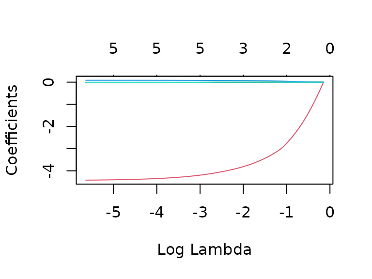

``` r
plot(cv_glm_reduced)
```

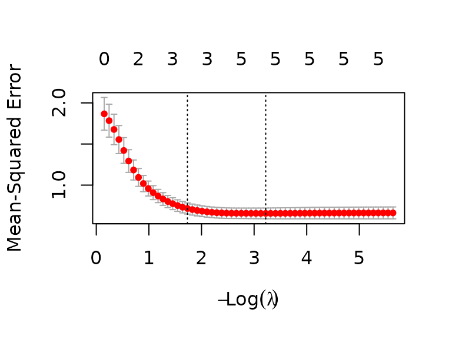 We now get a model
with 5 (or 3) parameters for minimum (or 1se) lambda, i.e. the minimum
MSE lambda will use all available predictors (distance, inclination,
temperature, average heart rate, and days since last training), whereas
the 1se lambda will ignore the temperature and days since last training
effects:

``` r
coef(fit_glm_reduced, cv_glm_reduced$lambda.min)
#> 6 x 1 sparse Matrix of class "dgCMatrix"
#>                              s=0.03992323
#> (Intercept)                  21.388765335
#> distance_km                  -0.011019946
#> avg_inclination              -4.244095168
#> temperature_c                -0.010307268
#> avg_hr_bpm                    0.081755859
#> days_since_previous_training -0.001526533
```

``` r
coef(fit_glm_reduced, cv_glm_reduced$lambda.1se)
#> 6 x 1 sparse Matrix of class "dgCMatrix"
#>                              s=0.1768847
#> (Intercept)                  22.62977386
#> distance_km                  -0.00551085
#> avg_inclination              -3.63267457
#> temperature_c                 .         
#> avg_hr_bpm                    0.06552551
#> days_since_previous_training  .
```

#### Random Effects Models

Since fitness levels could fluctuate between years (different loss of
fitness during the winter, increasing age, and other influences), adding
random effects might be another thing to try. As a baseline, a linear
model with fixed effects for distance, inclination, and heart rate was
chosen, which seems the most appropriate after what we’ve seen in the
previous sections. The first idea was to use a random effect for the
year, and maybe a nested random effect for months. After the tracks were
labelled (see “Clustering” and “Route-specific Linear Models” sections),
models with a random effect for the route and a 2-level model with a
random effect for years and a nested effect for route were also tried:

``` r
tracks_year_month <- corrected_tracks |>
  left_join(track_classes, join_by(date)) |>
  mutate(
    year = year(date),
    month = month(date)) |>
  filter(!is.na(track))

fit_baseline <- gls(speed_km_h ~ distance_km + avg_inclination + avg_hr_bpm, data = tracks_year_month)

fit_random_year <- lme(
  fixed = speed_km_h ~ distance_km + avg_inclination + avg_hr_bpm,
  random = ~ 1 | year,
  data = tracks_year_month)
fit_random_year_month <- lme(
  fixed = speed_km_h ~ distance_km + avg_inclination + avg_hr_bpm,
  random = ~ 1 | year/month,
  data = tracks_year_month)

fit_random_track <- lme(
  fixed = speed_km_h ~ distance_km + avg_inclination + avg_hr_bpm,
  random = ~ 1 | track,
  data = tracks_year_month)
fit_random_year_track <- lme(
  fixed = speed_km_h ~ distance_km + avg_inclination + avg_hr_bpm,
  random = ~ 1 | year/track,
  data = tracks_year_month)

anova(fit_baseline, fit_random_year, fit_random_year_month)
#>                       Model df      AIC      BIC    logLik   Test   L.Ratio
#> fit_baseline              1  5 384.7310 399.6147 -187.3655                 
#> fit_random_year           2  6 358.1971 376.0575 -173.0985 1 vs 2 28.533958
#> fit_random_year_month     3  7 352.7764 373.6135 -169.3882 2 vs 3  7.420717
#>                       p-value
#> fit_baseline                 
#> fit_random_year        <.0001
#> fit_random_year_month  0.0064
anova(fit_baseline, fit_random_year, fit_random_year_track)
#>                       Model df      AIC      BIC    logLik   Test   L.Ratio
#> fit_baseline              1  5 384.7310 399.6147 -187.3655                 
#> fit_random_year           2  6 358.1971 376.0575 -173.0985 1 vs 2 28.533958
#> fit_random_year_track     3  7 352.7737 373.6109 -169.3869 2 vs 3  7.423347
#>                       p-value
#> fit_baseline                 
#> fit_random_year        <.0001
#> fit_random_year_track  0.0064
anova(fit_baseline, fit_random_track)
#>                  Model df      AIC      BIC    logLik   Test L.Ratio p-value
#> fit_baseline         1  5 384.7310 399.6147 -187.3655                       
#> fit_random_track     2  6 384.5631 402.4235 -186.2816 1 vs 2 2.16791  0.1409
```

Comparing the models, we see that adding a random effect for the route
(`fit_random_track`) is not better than the fixed baseline model alone.
However, adding a random effect for the year results in a better model,
with the multi-level models with nested effects for month or track being
even better.

However, the random effects are rather small, for example, in the nested
year/month model, the standard deviations for the random year and month
effects are less than 0.6 and 0.3, respectively, with a standard
deviation of the residual errors of almost 0.7:

``` r
summary(fit_random_year_month)
#> Linear mixed-effects model fit by REML
#>   Data: tracks_year_month 
#>        AIC      BIC    logLik
#>   352.7764 373.6135 -169.3882
#> 
#> Random effects:
#>  Formula: ~1 | year
#>         (Intercept)
#> StdDev:   0.6237785
#> 
#>  Formula: ~1 | month %in% year
#>         (Intercept)  Residual
#> StdDev:   0.3546791 0.6572115
#> 
#> Fixed effects:  speed_km_h ~ distance_km + avg_inclination + avg_hr_bpm 
#>                     Value Std.Error  DF    t-value p-value
#> (Intercept)       24.0425   1.60039 117  15.022919  0.0000
#> distance_km       -0.0137   0.00421 117  -3.265322  0.0014
#> avg_inclination -422.7348  40.81293 117 -10.357865  0.0000
#> avg_hr_bpm         0.0605   0.01074 117   5.627163  0.0000
#>  Correlation: 
#>                 (Intr) dstnc_ avg_nc
#> distance_km      0.074              
#> avg_inclination -0.166 -0.391       
#> avg_hr_bpm      -0.950 -0.062 -0.082
#> 
#> Standardized Within-Group Residuals:
#>        Min         Q1        Med         Q3        Max 
#> -2.4187433 -0.6322553 -0.0592517  0.5322350  3.1249577 
#> 
#> Number of Observations: 149
#> Number of Groups: 
#>            year month %in% year 
#>               6              29
```

Note that only the most basic random effects were tried so far
(i.e. random intercepts), what could also be worth investigating is
adding random slopes, e.g. fitting a model that has a random effect for
the average heart rate, depending on the year. This has so far not been
explored further, due to time constraints.

### PCA

To get an impression of which variables are important, we can do a
principal component analysis:

``` r
numerical_track_components_pca <- corrected_tracks |>
  mutate(weekday = as.numeric(weekday)) |>
  select(!date & !previous_training_date & !samples)
pca <- prcomp(~ ., data = numerical_track_components_pca, scale = TRUE)
pca |>
  tidy("pcs") |> 
  ggplot(aes(x = PC, y = percent)) +
  geom_col() +
  labs(x = "PC", y = "Explained Variance")
```

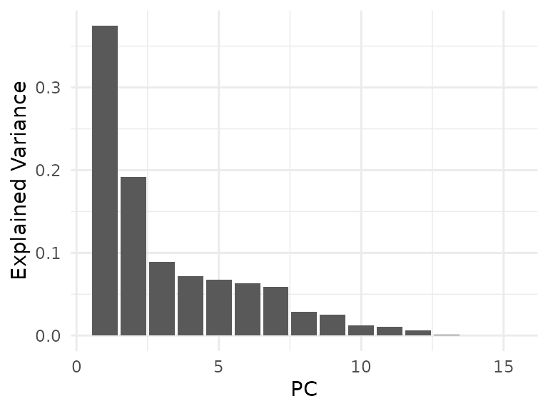

As can be seen from the scree plot, the first two principal components
explain almost 60% of the total variance in the data, with the next five
principal components still explaining between 5 and 10 percent each, and
each of the last six components explaining less than 5% of the total
variance.

Looking at some bi-plots for some combinations of the first seven
components, we can get a feeling for what the components mean:

``` r
biplot(pca, choices = 1:2, scale = 0)
```


``` r
biplot(pca, choices = 2:3, scale = 0)
```

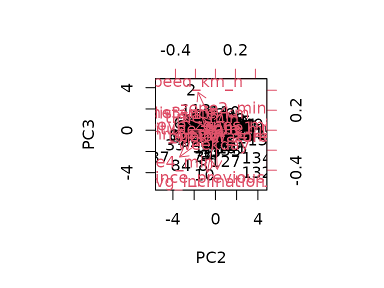

``` r
biplot(pca, choices = 3:4, scale = 0)
```


``` r
biplot(pca, choices = 4:5, scale = 0)
```

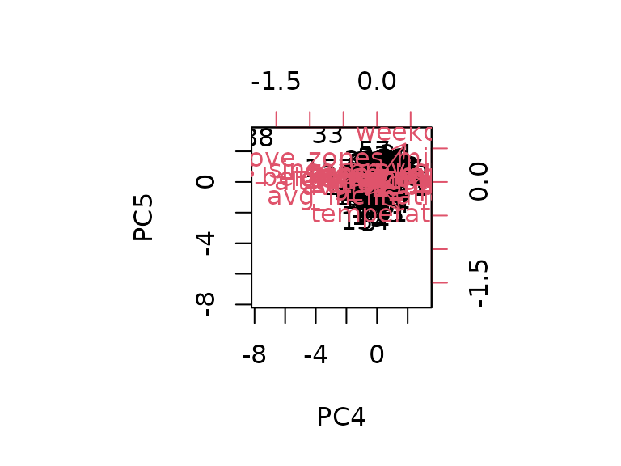

``` r
biplot(pca, choices = 5:6, scale = 0)
```


``` r
biplot(pca, choices = 6:7, scale = 0)
```

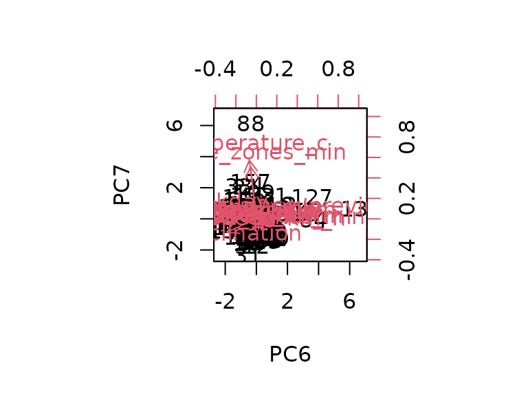

``` r

biplot(pca, choices = c(1,3), scale = 0)
```


``` r
biplot(pca, choices = c(1,4), scale = 0)
```


``` r
biplot(pca, choices = c(2,4), scale = 0)
```

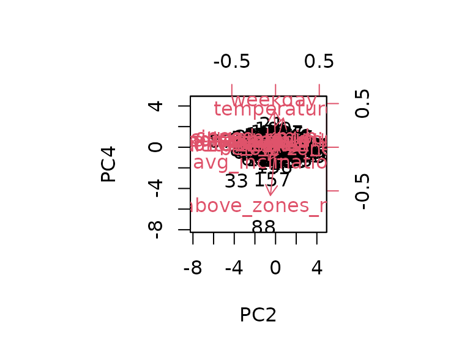

The two most important components seem to correspond mostly to
distance/altitude/inclination-related variables (PC1), and to heart
rate-related variables (PC2), which is not really surprising, seeing how
these are also the relevant predictors seen e.g. in the linear models.

What is striking, though, is the relatively clean grouping of data
points in the bi-plot of the first two components, which warrants
further investigation.

### Clustering

After the clusters observed in the PCA biplot, the next question is if
clustering reveals anything interesting.

First, some data preparation: for clustering, we need numeric data,
without `NA` values, and variables should be on the same scale.

``` r
scaled_tracks <- corrected_tracks |>
  mutate(weekday = as.numeric(weekday)) |>
  select(!date & !previous_training_date & !samples) |>
  scale() |>
  as_tibble() |>
  na.omit()
```

The first approach then is a Gaussian mixture model:

``` r
clusters_gaussian_mix <- Mclust(scaled_tracks)
plot(clusters_gaussian_mix, what = "classification")
```

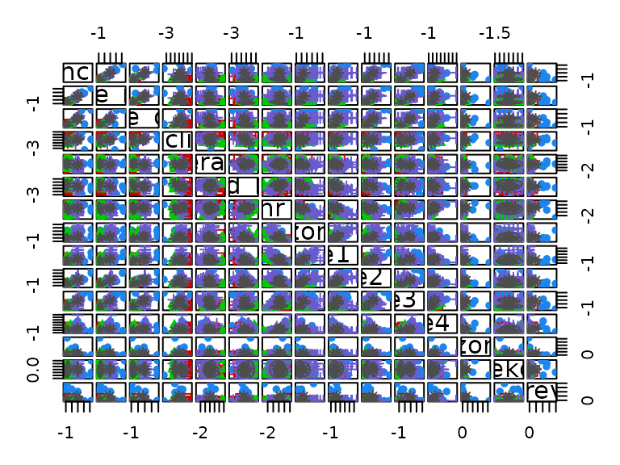

Since the plot matrix is somewhat hard to read, let’s plot track
distance vs speed, colored by clusters:

``` r
scaled_tracks |>
  mutate(cluster = factor(clusters_gaussian_mix$classification)) |>
  ggplot(aes(x = distance_km, y = speed_km_h, color = cluster)) +
  geom_point() +
  labs(x = "Standardized Distance", y = "Standardized Speed", color = "Cluster") +
  ggtitle("Gaussian Mixture Model Clustering")
```

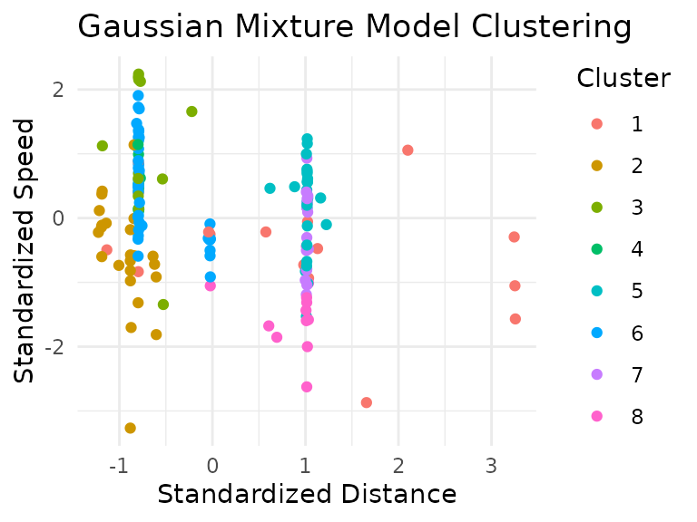

It appears the Gaussian mixture model seems to have clustered the data
primarily by track length.

Maybe a different clustering algorithm finds some other classes? Let’s
try density-based spatial clustering. To find good clustering
parameters, we start with a low `minPts` value, and try out some values
for `eps` that seem promising from the k-nearest-neighbor-distance-plot:

``` r
kNNdistplot(scaled_tracks, k = 1)
abline(h = 2.1, col = "red")
abline(h = 0.5, col = "blue",lty = 2)
abline(h = 2.55, col = "blue",lty = 2)
abline(h = 3.25, col = "blue",lty = 2)
abline(h = 4.1, col = "blue",lty = 2)
```

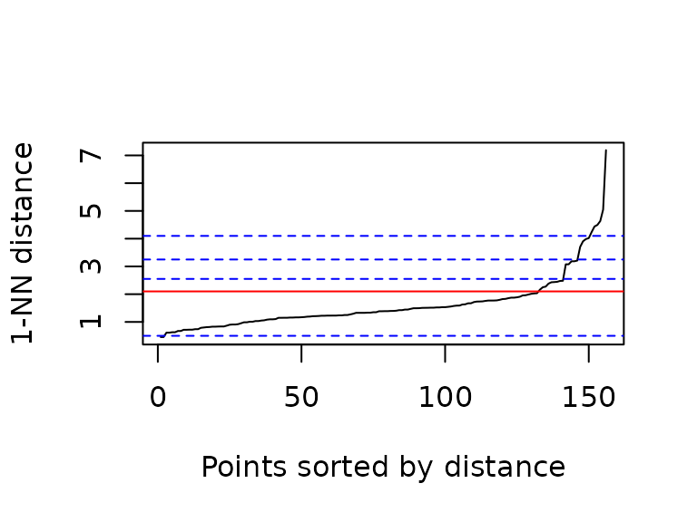

`k = 1` corresponds to a `minPts` value of 2, and the values for the
`abline`s in the plot were tried out. The red line (corresponding to a
$\varepsilon$, i.e. an `eps` value, of 2.1) results in three clusters
(and a fourth group for “noise” data points):

``` r
clusters_db <- dbscan(scaled_tracks, eps = 2.1, minPts = 2)

scaled_tracks |>
  mutate(cluster = factor(clusters_db$cluster)) |>
  ggplot(aes(x = distance_km, y = speed_km_h, color = cluster)) +
  geom_point() +
  labs(x = "Standardized Distance", y = "Standardized Speed", color = "Cluster") +
  ggtitle("Density-Based Spatial Clustering")
```

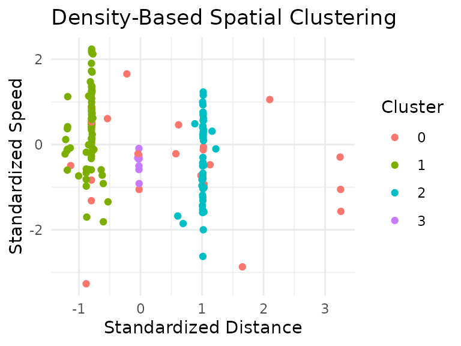

Higher density values (i.e. higher values for the `eps` parameter, and
higher values for `k` in the k-NN plot) need different `eps` values,
however, during experimenting with different `k` (and thus `minPts`)
values, as well as different `eps` values has only resulted in fewer
clusters, most of the time only one “real” and one noise cluster. Even
with the three clusters above, we see again a classification that seems
to be mostly based on track distance.

### Route-specific Linear Models

After the results of the clustering attempts (and some discussions
during the intermediate presentation), the tracks were manually
classified, based on the route driven, and (for one particular route)
also the direction in which the route was driven (all other routes were
only ever driven in one direction).

This should result in much better comparability for tracks from the same
group, since differences among routes (that cannot easily be gleaned
from the data) can be eliminated by just comparing tracks using the same
route.

With that, let’s try fitting a linear model again, but this time a
route-specific one. We’ll arbitrarily pick tracks 1, 2, and 4 (about 25,
40, and 60 kilometers, respectively) for modelling.

To get a better sense for the chosen tracks: the chosen tracks are the
purple, blue, and green tracks on the following map:

``` r
track_linestrings |>
  left_join(track_classes, join_by(date)) |>
  filter(!is.na(track)) |>
  ggplot() +
  geom_sf(aes(color = track)) +
  scale_color_viridis_c(option = "turbo")
```

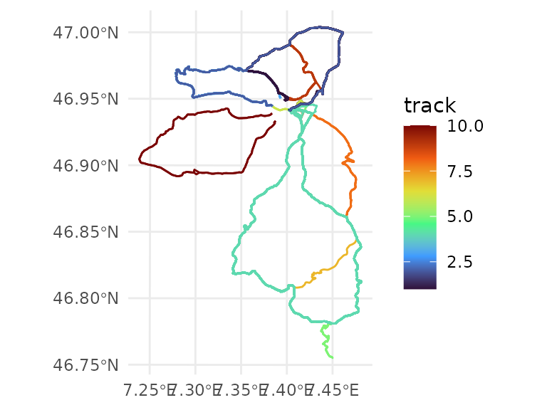

Selecting the tracks:

``` r
labeled_tracks <- corrected_tracks |>
  left_join(track_classes, join_by(date))

tracks_1 <- labeled_tracks |>
  filter(track == 1)
tracks_2 <- labeled_tracks |>
  filter(track == 2)
tracks_4 <- labeled_tracks |>
  filter(track == 4)
```

Since the route is now always the same for tracks of the same group, the
distance and inclination is always the same, and therefore won’t be able
to predict variations in speed. Thus, let’s try a model using heart rate
and temperature:

``` r
fit_track_1 <- lm(speed_km_h ~ avg_hr_bpm + temperature_c, data = tracks_1)
summary(fit_track_1)
#> 
#> Call:
#> lm(formula = speed_km_h ~ avg_hr_bpm + temperature_c, data = tracks_1)
#> 
#> Residuals:
#>      Min       1Q   Median       3Q      Max 
#> -1.13855 -0.51188 -0.06761  0.34820  2.29499 
#> 
#> Coefficients:
#>               Estimate Std. Error t value Pr(>|t|)    
#> (Intercept)   18.71064    1.71732  10.895 4.95e-15 ***
#> avg_hr_bpm     0.06522    0.01192   5.473 1.29e-06 ***
#> temperature_c  0.03112    0.03086   1.008    0.318    
#> ---
#> Signif. codes:  0 '***' 0.001 '**' 0.01 '*' 0.05 '.' 0.1 ' ' 1
#> 
#> Residual standard error: 0.721 on 52 degrees of freedom
#> Multiple R-squared:  0.4011, Adjusted R-squared:  0.3781 
#> F-statistic: 17.41 on 2 and 52 DF,  p-value: 1.627e-06
plot(fit_track_1)
```

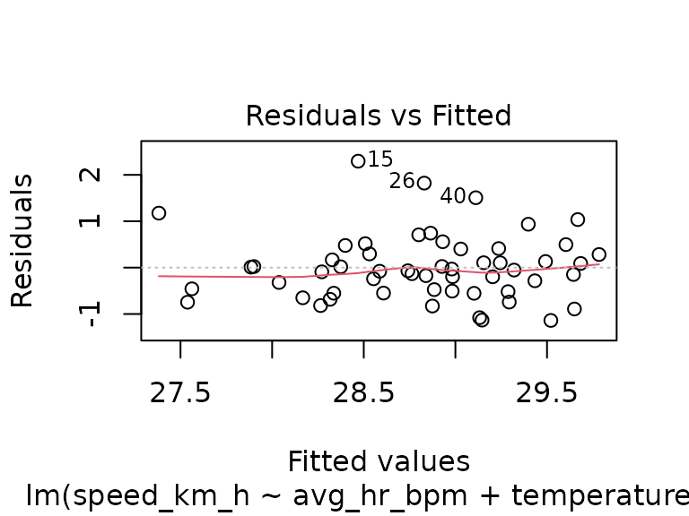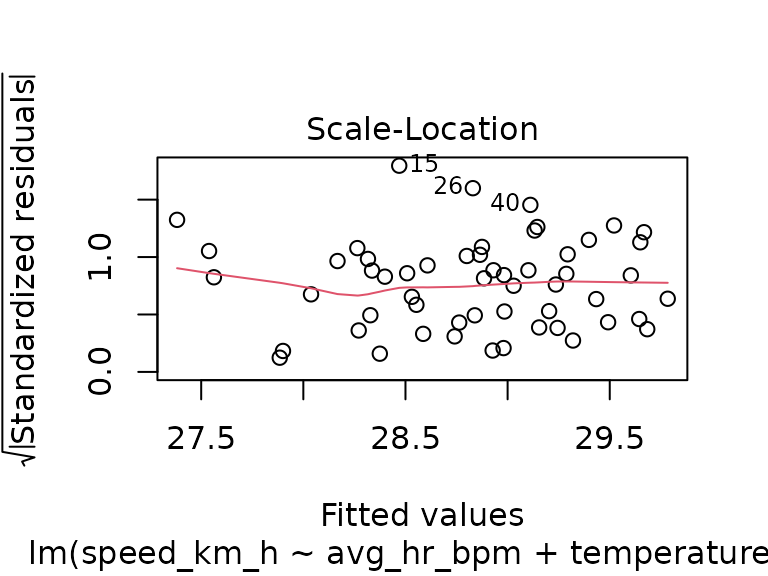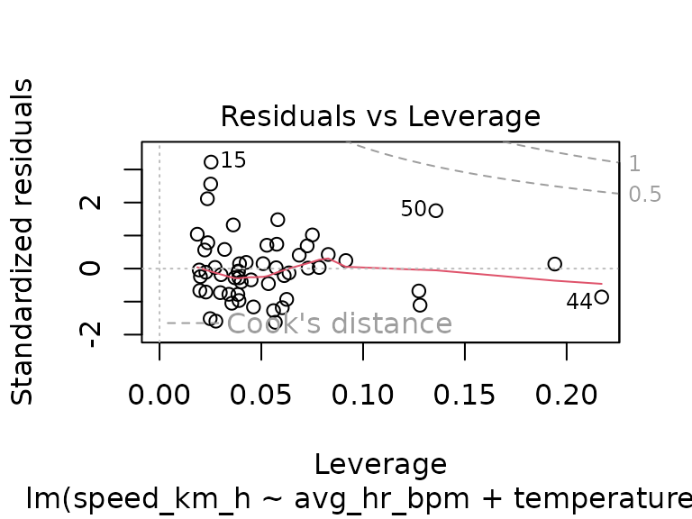

``` r
fit_track_2 <- lm(speed_km_h ~ avg_hr_bpm + temperature_c, data = tracks_2)
summary(fit_track_2)
#> 
#> Call:
#> lm(formula = speed_km_h ~ avg_hr_bpm + temperature_c, data = tracks_2)
#> 
#> Residuals:
#>      Min       1Q   Median       3Q      Max 
#> -0.31001 -0.06857  0.05155  0.12025  0.24216 
#> 
#> Coefficients:
#>               Estimate Std. Error t value Pr(>|t|)    
#> (Intercept)   17.06636    2.02651   8.422 6.56e-05 ***
#> avg_hr_bpm     0.07855    0.01511   5.198  0.00126 ** 
#> temperature_c -0.03064    0.02948  -1.039  0.33326    
#> ---
#> Signif. codes:  0 '***' 0.001 '**' 0.01 '*' 0.05 '.' 0.1 ' ' 1
#> 
#> Residual standard error: 0.2064 on 7 degrees of freedom
#> Multiple R-squared:  0.7946, Adjusted R-squared:  0.7359 
#> F-statistic: 13.54 on 2 and 7 DF,  p-value: 0.003928
plot(fit_track_2)
```

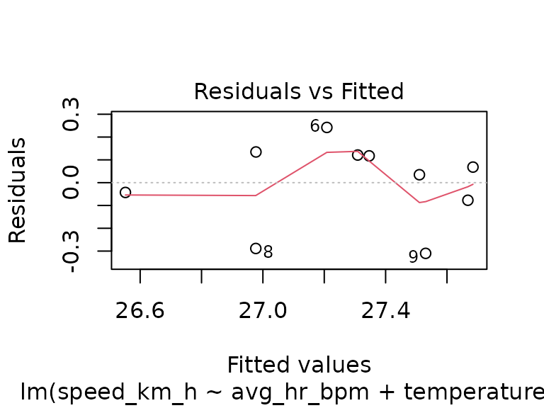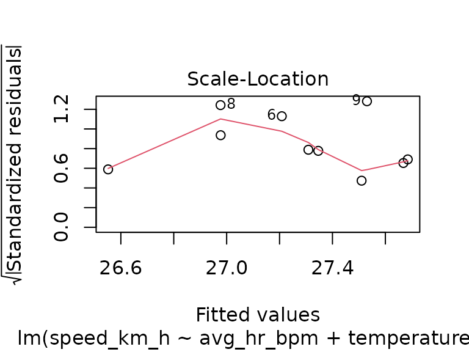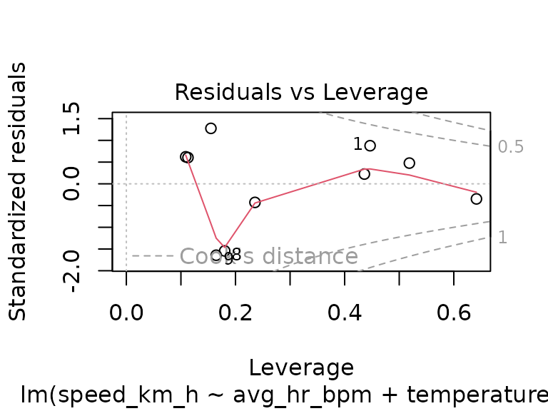

``` r
fit_track_4 <- lm(speed_km_h ~ avg_hr_bpm + temperature_c, data = tracks_4)
summary(fit_track_4)
#> 
#> Call:
#> lm(formula = speed_km_h ~ avg_hr_bpm + temperature_c, data = tracks_4)
#> 
#> Residuals:
#>     Min      1Q  Median      3Q     Max 
#> -2.4289 -0.4170  0.1001  0.6196  1.4331 
#> 
#> Coefficients:
#>               Estimate Std. Error t value Pr(>|t|)    
#> (Intercept)   11.65598    2.63503   4.423 5.40e-05 ***
#> avg_hr_bpm     0.10733    0.01654   6.489 4.11e-08 ***
#> temperature_c  0.00604    0.03664   0.165     0.87    
#> ---
#> Signif. codes:  0 '***' 0.001 '**' 0.01 '*' 0.05 '.' 0.1 ' ' 1
#> 
#> Residual standard error: 0.8631 on 49 degrees of freedom
#> Multiple R-squared:  0.4682, Adjusted R-squared:  0.4465 
#> F-statistic: 21.57 on 2 and 49 DF,  p-value: 1.908e-07
plot(fit_track_4)
```

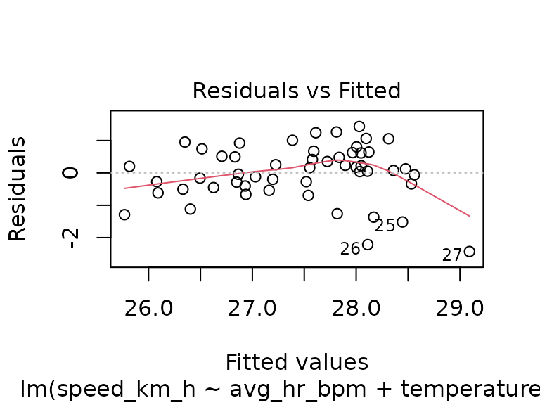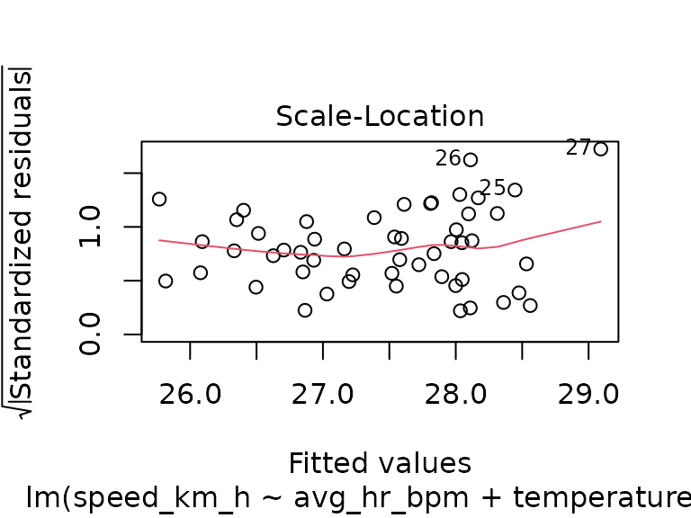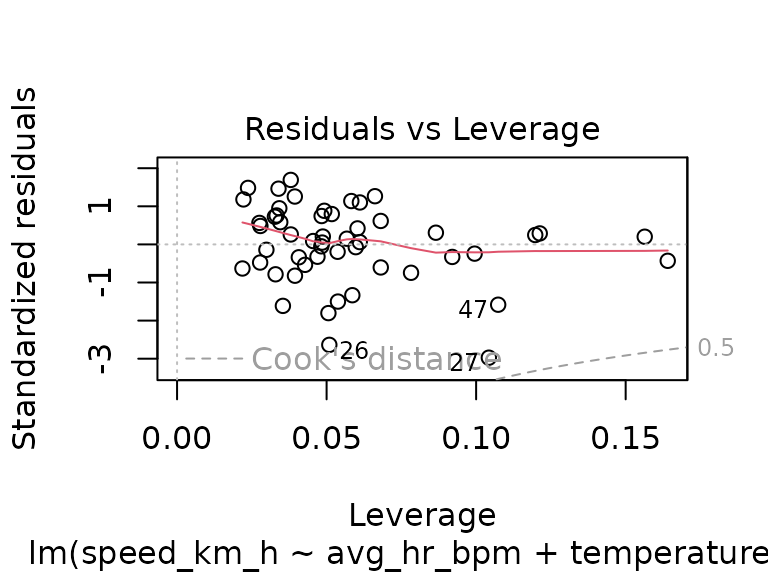

For all of the three routes, we see that the temperature has no
significant effect. Again, we could try to find a training effect during
the course of the season, however, for the selected tracks we now have
fewer data points per route: only 10 tracks in group 2, and while tracks
in groups 1 and 4 have 55 and 52 observations, the observations for
group 4 are almost all in the later part of the season, which is not
great for modeling:

``` r
tracks_1 |> ggplot(aes(x = month(date))) + geom_bar()
```

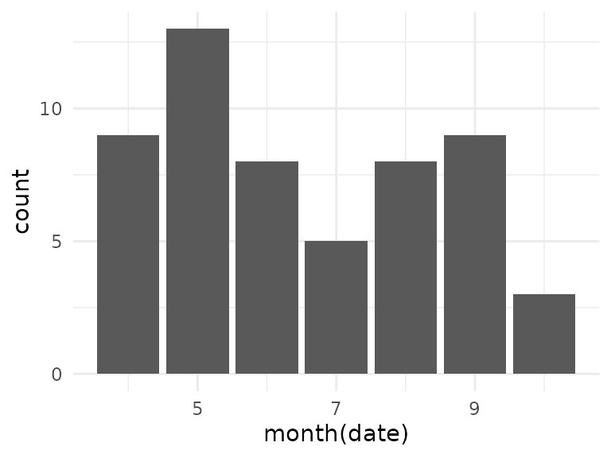

``` r
tracks_4 |> ggplot(aes(x = month(date))) + geom_bar()
```

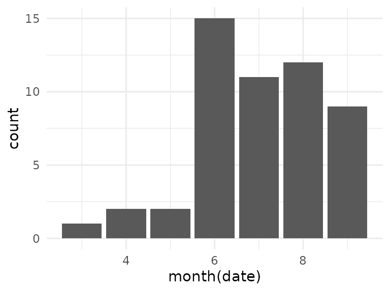

The class 1 tracks only have 3 observations in October, but overall the
number of available data points for this group looks better, so let’s
try to create a model for this group:

``` r
tracks_1_speed_month <- tracks_1 |>
  mutate(month = as.factor(month(date))) |>
  select(speed_km_h, month)

fit_tracks_1_month <- lm(speed_km_h ~ month, data = tracks_1_speed_month)
summary(fit_tracks_1_month)
#> 
#> Call:
#> lm(formula = speed_km_h ~ month, data = tracks_1_speed_month)
#> 
#> Residuals:
#>      Min       1Q   Median       3Q      Max 
#> -1.56163 -0.49759 -0.05842  0.58971  1.77622 
#> 
#> Coefficients:
#>             Estimate Std. Error t value Pr(>|t|)    
#> (Intercept) 28.98822    0.28323 102.348   <2e-16 ***
#> month5       0.01964    0.36845   0.053    0.958    
#> month6      -0.90112    0.41288  -2.183    0.034 *  
#> month7      -0.02002    0.47394  -0.042    0.966    
#> month8       0.49069    0.41288   1.188    0.240    
#> month9      -0.32493    0.40055  -0.811    0.421    
#> month10     -0.91418    0.56646  -1.614    0.113    
#> ---
#> Signif. codes:  0 '***' 0.001 '**' 0.01 '*' 0.05 '.' 0.1 ' ' 1
#> 
#> Residual standard error: 0.8497 on 48 degrees of freedom
#> Multiple R-squared:  0.2322, Adjusted R-squared:  0.1362 
#> F-statistic: 2.419 on 6 and 48 DF,  p-value: 0.04008
plot(fit_tracks_1_month)
```

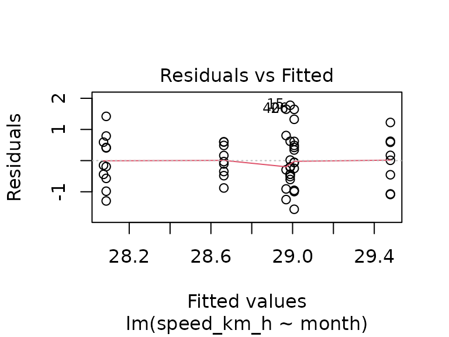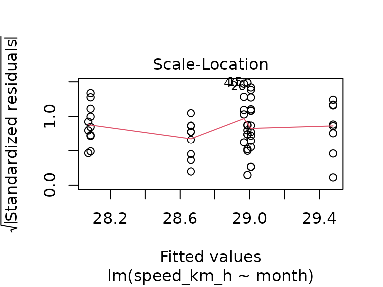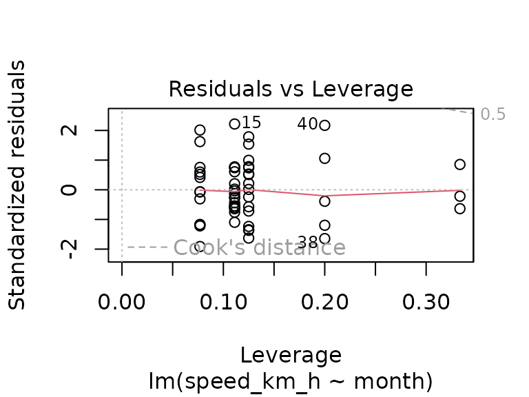

Again, no significant effect can be found. Considering that the model
using heart rate and temperature explained only 40% of the variance, and
without an obvious training effect over the course of the season, there
are probably factors influencing the average speed that are not
available in the data. This could be environmental factors (e.g. wind),
or fitness-related factors (e.g. influences of other trainings that were
not recorded). In any case, the available data seems insufficient to
accurately predict the average speed for a track, with the only somewhat
certain statement seeming “higher average heart rate (i.e. higher
training effort) correlates with higher average speed”, which seems
logical, even without looking at the data.

### Dynamic Time Warping

Another technique suggested during the discussion after the mid-term
presentation is dynamic time warping. Tracks along the same route could
be time-warped, and the resulting mappings could then be analyzed to
find parts of the route that have low or high variation among tracks.

Due to time constraints, this is not finished yet, it is still very much
work in progress.

``` r
tracks_1_fastest <- tracks_1 |> slice_min(time_min) |> pull(date)
tracks_1_slowest <- tracks_1 |> slice_max(time_min) |> pull(date)

t1f <- track_details |>
  filter(date == tracks_1_fastest) |>
  select(latitude, longitude)
t1s <- track_details |> 
  filter(date == tracks_1_slowest) |>
  select(latitude, longitude)
a <- dtw(t1s, t1f, keep = TRUE)
plot(a, type = "alignment")
```


``` r
plot(a, type = "density")
```

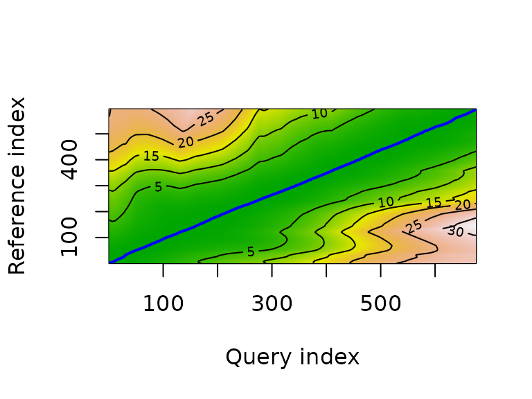

``` r
#plot(a, type = "two", offset = -200)
```

``` r
tracks_2_fastest <- tracks_2 |> slice_min(time_min) |> pull(date)
tracks_2_slowest <- tracks_2 |> slice_max(time_min) |> pull(date)

t2f <- track_details |>
  filter(date == tracks_2_fastest) |>
  select(latitude, longitude)
t2s <- track_details |> 
  filter(date == tracks_2_slowest) |>
  select(latitude, longitude)
b <- dtw(t2s, t2f, keep = TRUE)
plot(b, type = "alignment")
```


``` r
plot(b, type = "density")
```

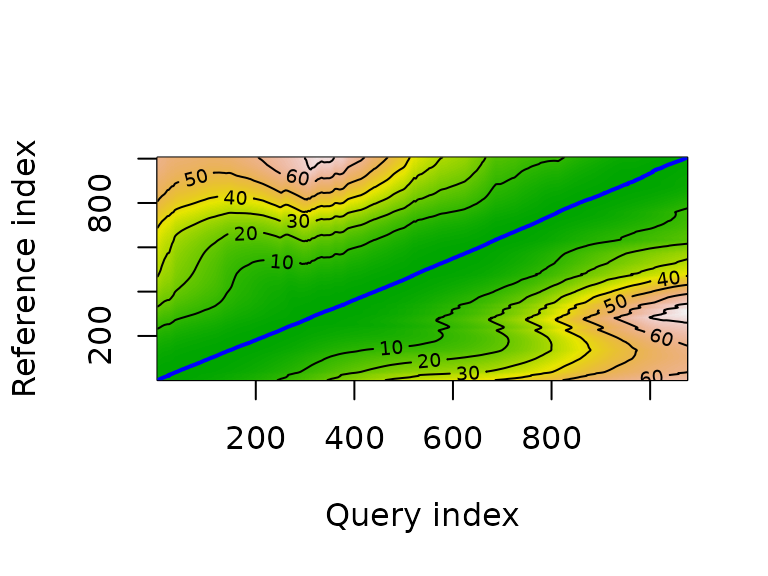

``` r
#plot(a, type = "two", offset = -200)
```

``` r
tracks_4_fastest <- tracks_4 |> slice_min(time_min) |> pull(date)
tracks_4_slowest <- tracks_4 |> slice_max(time_min) |> pull(date)

t4f <- track_details |>
  filter(date == tracks_4_fastest) |>
  select(latitude, longitude)
t4s <- track_details |> 
  filter(date == tracks_4_slowest) |>
  select(latitude, longitude)
c <- dtw(t4s, t4f, keep = TRUE)
plot(c, type = "alignment")
```


``` r
plot(c, type = "density")
```

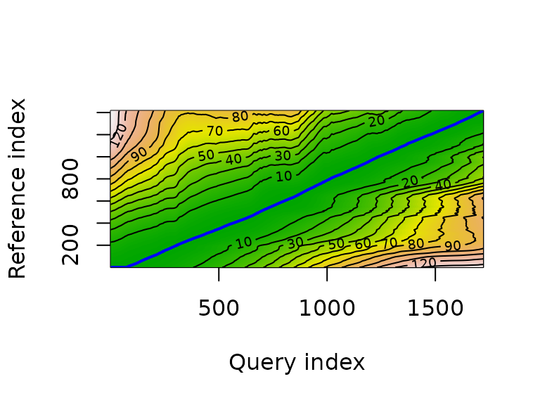

``` r
#plot(a, type = "two", offset = -200)
```
